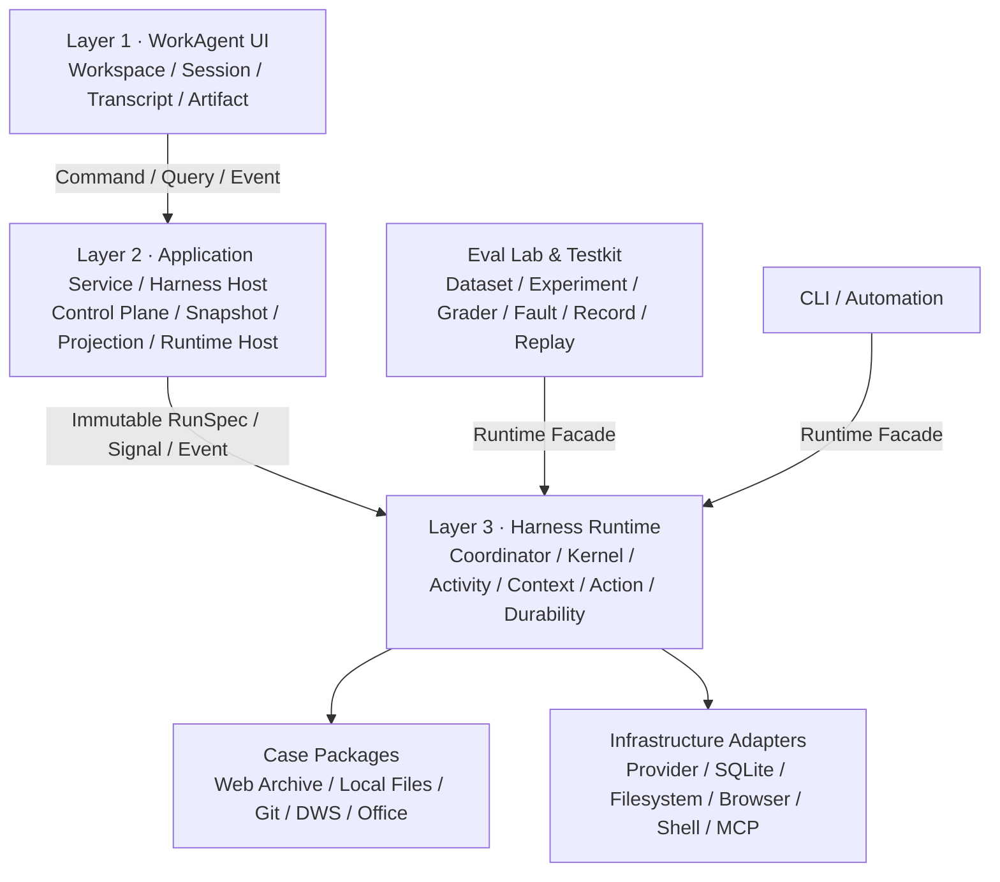

# WorkAgent

> 一个面向真实办公任务、Case 无关、可观察、可恢复、可实验评测的生产级 Agent Harness；最终形态是可供个人长期使用的本地桌面 Work Agent。

## 项目状态

**当前阶段：正式编码前的架构与核心 Contract 设计。**

截至 2026-08-21，项目已经完成行业与前端技术调研、三轮目标对焦、第一版总体架构设计、架构评审及 V02 修订；尚未进入可运行产品的实现阶段，因此当前没有安装、构建或启动命令。

- 上位讨论基线：[WorkAgent 目标定位与技术架构三次对焦讨论进展](sxw_aicoding/方案讨论/WorkAgent目标定位与技术架构三次对焦讨论进展.md)
- 最新架构设计：[WorkAgent 架构设计 V20260821_02](sxw_aicoding/架构设计/WorkAgent架构设计_V20260821_02.md)
- 当前下一步：冻结最小 `AgentSpec / RunSpec / KernelInput / Directive / RuntimeSignal / RunEvent` Contract，并实现 Headless Walking Skeleton

## 项目北极星

> 自研一个面向真实办公任务、Case 无关、可观察、可恢复、可实验评测的生产级 Agent Harness；通过亲自实现其核心机制完成系统性学习，并用个人真实任务持续检验和提升效果，最终形成可供个人长期使用的桌面 Work Agent。

“Case 无关”是一条依赖规则，而不是万能性承诺：Harness Core 不得依赖网页归档、Git、钉钉或 Office 等具体业务语义，它的通用性需要由多个差异化真实 Case 持续反证。

这个项目同时承担四层价值：

1. **Agent Harness 学习项目**：亲自理解并实现生产级 Harness 的核心机制；
2. **Agent 实验平台**：替换策略、记录轨迹、复现实验并比较效果；
3. **真实任务执行器**：用个人办公场景持续暴露可靠性和效果问题；
4. **个人桌面产品**：最终沉淀为可长期使用的 Work Agent，而非研究 Demo。

## 为什么做这个项目

Work Agent 的竞争焦点已经从“能否生成内容”转向“能否可靠完成真实工作”。模型提供推理能力，但长任务的最终效果越来越取决于模型周围的工程系统：

- Agent Loop、状态机和停止条件；
- Context 的选择、外置、取回、压缩与来源追踪；
- Tool 的生命周期、重试、幂等和执行后验证；
- Durable State、Resume、Replay 和故障恢复；
- Capability、Policy、Approval 和副作用控制；
- Trace、Eval、故障注入与回归比较；
- Artifact 的来源、版本、验证与交付。

本项目选择自研这些 Harness 核心机制，同时复用模型 SDK、MCP、SQLite、Chrome、Git、文件格式处理等成熟基础设施，以学习价值和真实任务效果作为主要取舍标准。

## 核心架构



架构由三个互不替代的中心对象组成：

| 对象 | 回答的问题 | 核心职责 |
|---|---|---|
| **Workspace** | AI 在哪里工作，可以访问什么？ | 资源、能力配置、授权和工作环境边界 |
| **Session** | 用户和 AI 围绕什么持续交流？ | 多轮对话、意图演进、Transcript 和跨 Run 工作连续性 |
| **Run** | Agent 针对一次输入实际执行了什么？ | 单次执行、状态推进、恢复、Trace 和评测 |

`Session` 是 WorkAgent 产品的一等对象，但不是 Harness Runtime 的前提。CLI、Eval、Automation 和 Micro Case 都可以直接发起无 Session 的 Headless Run。

### 分层边界

- **Layer 1 — WorkAgent UI**：展示 Message、Tool、Approval、External Interaction、Artifact 和 Run 状态，但不拥有运行状态机与安全决策。
- **Layer 2 — Application Service / Harness Host**：管理可变的产品配置，并在 Run 启动时冻结为不可变 Snapshot；负责 Runtime 组装、产品投影和 API。
- **Layer 3 — Harness Runtime**：拥有 Case 无关的执行语义，不依赖 UI、Application Repository、Electron、Eval Dataset 或具体业务 Case。
- **Eval Lab**：从项目早期就是 P0 系统能力，但位于 Runtime 外部，通过相同 Runtime Facade 驱动实验。

### 一次 Run 的基本闭环

```text
Observe current state
        ↓
Compile a valid ContextFrame
        ↓
Model decides
        ↓
Normalize Tool Call → ProposedAction
        ↓
Resolve trusted Effect → PreparedAction
        ↓
Capability / Policy / Approval
        ↓
Execute durable RuntimeActivity
        ↓
Observe external state and verify postcondition
        ↓
Continue / Wait / Complete / Recover / Fail
```

Tool 返回“调用成功”不等于任务已经完成。重要副作用需要重新观察外部世界并验证后置条件。

## 关键设计不变量

### 1. 纯决策与异步执行分离

Kernel 是纯状态转换，只消费规范化的最终 `ActivityOutcome`；Model Delta、Tool Progress 和 Heartbeat 通过 transient event 旁路输出。Model、Tool、Observation、Verification 和 Context Compaction 都作为可持久化的 `RuntimeActivity` 执行。

### 2. 配置冻结，实时安全不冻结

每个 Run 绑定不可变 `RunSpec`，冻结 Prompt、Tool、Skill、Policy、Capability Grant、Conversation Source 和环境证据，用于恢复与复现。但实时撤权、凭证过期、资源不可用和紧急停止仍可阻止后续执行。

### 3. 外部副作用前先持久化意图

执行文件写入、Shell、Browser 或外部 API 之前，Runtime 必须先解析真实 Effect、持久化 `PreparedAction / Attempt Intent`，再取得 Capability Lease 执行。Crash 后不能通过“再跑一次”恢复未知副作用。

### 4. Context 是核心运行系统

Session History 与 Run Working Context 分开治理。每次模型调用都形成可追踪的 `ContextFrame`；大 Tool Result 经过校验、脱敏、外置和分页取回；Tool Call / Result 必须合法配对；Compact 不删除原始 durable facts。

### 5. 错误事实与处置结果分离

Runtime 同时记录错误来源、类别、retryability 和 `SideEffectState`。自动重试必须同时满足 Retry Policy、预算、幂等性、实时授权和副作用确定性；`UNKNOWN / PARTIALLY_APPLIED` 默认进入 Observation、Recovery 或人工处理。

### 6. Durable Signal 与协作式取消

用户输入、Approval、Pause、Resume、Cancel 和人工接管完成信号进入 durable inbox，具备幂等、排序、目标校验和离线恢复语义。Cancel 同时通过 Abort 通道中断当前 Activity，迟到结果不能覆盖已经提交的新状态。

### 7. Trace、Projection 和 Audit 分离

- Runtime Trace 是执行事实；
- Transcript 是面向用户的可重建产品投影；
- Product Audit 记录资源、能力、策略、审批和产物管理操作；
- 流式 Delta 是体验事件，不参与恢复事实判断。

### 8. Artifact 是一等领域对象

Artifact 具有来源 Run、Action/Attempt、checksum、版本、lineage、验证状态和交付角色。Runtime Blob 只是执行内部载体，不自动成为 Artifact；Deliverable 原则上必须经过验证。

## 首个真实 Case：登录态网页归档

Case 01 使用 Chrome 登录态完成网页正文整理、媒体下载和离线归档，预期产物包括：

- 结构化 Markdown 正文；
- 图片和视频等媒体文件；
- Manifest 与完整性报告；
- 可交付 ZIP Artifact。

它用于综合验证 Browser Capability、不可信网页内容、长时间下载、Human Takeover、取消与恢复、大结果外置、Artifact lineage 和确定性校验。

网页归档的大部分步骤可以由确定性程序完成，因此项目会同时实现：

1. 确定性 Workflow Baseline；
2. Agent 自适应编排实现；
3. 稳定回归、真实世界和故障注入三类 Eval；
4. 对“Agent 在哪些环节真正产生增益”的实验结论。

在冻结更高层通用接口前，还会选择一个与网页归档差异明显、推理和决策更重的 Case 02，用它反证 Tool、Context、Capability、Workspace 和 Artifact 抽象。

## 安全模型

项目只服务作者个人，默认采用低摩擦的 `TRUSTED_PERSONAL` Policy Preset，但不会删除安全边界：

- 优先使用 dry-run、diff、staging、备份、原子替换、执行后验证和补偿动作；
- Workspace 内可恢复的常规读写默认放行；
- 递归删除、不可恢复覆盖、越权写入、危险 Git 操作和外部数据发送需要拦截或确认；
- Cookie、Token 和浏览器存储不进入模型 Context 或 Trace；
- 网页、文件、邮件和 Tool Result 默认视为不可信内容；
- Approval 绑定真实 `ResolvedEffect`、preview 与 `actionDigest`，不能仅展示模型的自然语言解释。

`TRUSTED_PERSONAL` 是可替换的策略预设，不是 Kernel 中写死的安全假设。

## 技术方向

以下状态刻意区分“已确认架构方向”和“仍需验证的技术候选”：

| 领域 | 当前方向 | 状态 |
|---|---|---|
| Harness Runtime | TypeScript / Node.js，Headless、Case 无关 | 当前方向 |
| Kernel | 纯状态转换 + Coordinator durable orchestration | 已对齐 |
| 持久化 | 事实表 + Durable Event + Snapshot + immutable Blob | 已对齐 |
| 本地存储 | SQLite，产品表与 Runtime 表所有权分离 | 候选方向 |
| Eval | Recorded Model/Activity、FakeClock、GoldenTrace、Fault Injection | 已对齐 |
| 桌面端 | Electron + React + TypeScript | 候选方向，不能成为 Runtime 前提 |
| 前端事件 | 版本化产品事件；HTTP/SSE 为主，双向场景按需 WebSocket | 当前方向 |
| Agentic UI 协议 | 自有事件层参照 AG-UI 语义，渲染层保持可替换 | 当前方向 |
| 浏览器能力 | Chrome 登录态 Bridge；Extension / Native Messaging / CDP 组合待设计 | 待精确设计 |
| 扩展生态 | MCP、Skill、Plugin 内部保留不同语义 | 已对齐 |

项目不会使用外部 Agent 框架替代 Harness Core；模型 Provider SDK、MCP SDK、数据库驱动、Chrome/Git/HTTP/压缩和文件格式处理库则优先复用成熟实现。

## 路线图

- [x] **阶段 0：讨论基线与总体架构** — 目标对焦、技术调研、V01 设计、架构评审与 V02 修订
- [ ] **阶段 1：Headless Walking Skeleton** — 纯 Kernel、Coordinator、Fake/Recorded Model、最小 Tool、Signal、Budget、Trace 和 Micro Cases
- [ ] **阶段 2：Durable Runtime** — SQLite、Event、Snapshot、Blob、Crash Resume、Replay、Policy、Approval、Artifact 与故障注入
- [ ] **阶段 3：Case 01 网页归档** — Chrome 登录态、Human Takeover、媒体归档、确定性 Baseline 与多配置 Eval
- [ ] **阶段 4：Case 02 与架构反证** — 用差异化任务检验并重构通用 Contract
- [ ] **阶段 5：桌面产品化** — Workspace、Session、Transcript、Tool、Approval、Artifact、Trace/Eval Inspector
- [ ] **阶段 6：评测驱动增强** — 高级 Context、Memory、Planner/Verifier、Sub-agent 和更多办公 Capability

Planning、Memory、Sub-agent 和并行执行不会因为“看起来先进”而预设进 Kernel，只有在真实 Case 和 Eval 证明收益后才引入。

## 文档导航

建议按以下顺序阅读：

| 顺序 | 文档 | 说明 |
|---|---|---|
| 1 | [目标定位与技术架构三次对焦讨论进展](sxw_aicoding/方案讨论/WorkAgent目标定位与技术架构三次对焦讨论进展.md) | 当前唯一有效的上位讨论基线 |
| 2 | [架构设计 V20260821_02](sxw_aicoding/架构设计/WorkAgent架构设计_V20260821_02.md) | 当前最新总体架构、不变量与执行语义 |
| 3 | [架构设计 V20260821_01 评审](sxw_aicoding/方案评审/WorkAgent架构设计_V20260821_01_评审.md) | V02 修订的问题来源和评审证据 |
| 4 | [架构设计 V20260821_01](sxw_aicoding/架构设计/WorkAgent架构设计_V20260821_01.md) | 第一版完整设计，保留决策演进记录 |
| 5 | [WorkAgent 调研报告](sxw_aicoding/WorkAgent调研/WorkAgent调研.md) | 行业格局、Harness、Context、协议、执行与安全全景 |
| 6 | [Work Agent 前端技术栈调研](sxw_aicoding/WorkAgent调研/WorkAgent前端技术栈调研.md) | 桌面壳、Agent UI、流式渲染、Tool 与 Artifact 技术建议 |
| 7 | [Agentic UI 协议调研](sxw_aicoding/WorkAgent调研/AgenticUI协议调研.md) | AG-UI、MCP Apps、A2UI、ACP 等协议的分层与选型边界 |

## 当前目录

```text
sxw_work-agent/
├── README.md
└── sxw_aicoding/
    ├── WorkAgent调研/
    │   ├── WorkAgent调研.md
    │   ├── WorkAgent前端技术栈调研.md
    │   └── AgenticUI协议调研.md
    ├── 方案讨论/
    │   └── WorkAgent目标定位与技术架构三次对焦讨论进展.md
    ├── 方案评审/
    │   └── WorkAgent架构设计_V20260821_01_评审.md
    ├── 架构设计/
    │   ├── WorkAgent架构设计_V20260821_01.md
    │   └── WorkAgent架构设计_V20260821_02.md
    ├── Roadmap/
    └── temp/
```

## 当前非目标

- 快速复刻 WorkBuddy、OpenWork、OpenCode 等现有产品；
- 用外部框架整体替代 Harness Core；
- 多 Agent 作为首期默认架构；
- 为尚不存在的外部 Engine 设计万能 Adapter；
- 多租户、企业 SSO/RBAC、商业计费、管理后台；
- 云端 Runtime、多端同步和 Skill 市场；
- 为展示 Agent 能力而人为制造不必要的多轮调用。

## 项目完成标准

项目不以代码量或功能数量衡量阶段完成。每个主要研究问题都应形成一条可复盘的证据链：

```text
Problem → Hypothesis → Alternatives → Implementation
        → Eval Evidence → ADR → Postmortem → Interview Narrative
```

最终目标不是得到一个“能跑的聊天框”，而是能够用实现、Trace、故障样本和评测数据解释：Agent 为什么成功、为什么失败、如何安全恢复，以及某项 Harness 策略是否真的改善了真实任务效果。
