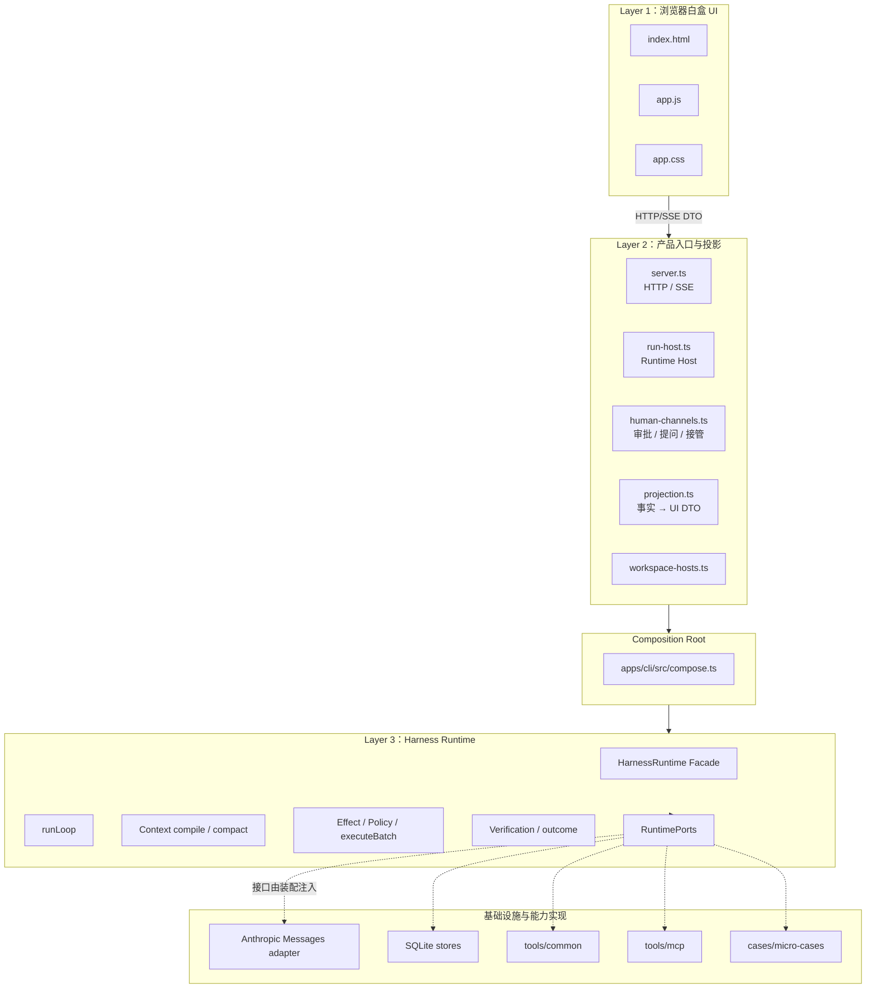
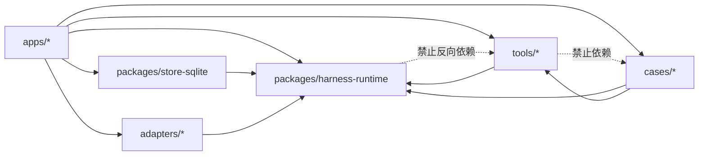

# 01. 整体架构与边界

## 1. 架构结论

Atlas 当前可以概括为：

> 一个单进程、消息级持久化、端口驱动的 Agent Harness。主循环负责把自然语言目标持续推进为模型调用和受控工具副作用；执行条件随 Run 冻结；transcript 支撑恢复；RunEvent/Trace 支撑观察；Service/UI 只提供人机入口和事实投影。

它更接近“六边形架构中的执行内核 + append-only 恢复日志”，而不是一个普通聊天应用，也不是完整的 Event Sourcing 系统：**RunEvent 不参与恢复，只有 transcript 参与恢复。**

## 2. 分层全景图



### Layer 1：`apps/workagent-ui/public/`

- 原生 HTML/CSS/JS，无构建、无 import；入口见 [`index.html:53-94`](../../apps/workagent-ui/public/index.html#L53-L94)。
- 只能通过 HTTP/SSE DTO 观察系统，物理上拿不到 Runtime 类型和函数。
- 所有模型文本用 `textContent` 写入 DOM；统一 DOM 工厂在 [`app.js:112-141`](../../apps/workagent-ui/public/app.js#L112-L141)。
- 它拥有的是临时展示状态：当前 tab、展开项、当前 SSE、Trace/模型审计面板状态；总容器 `S` 在 [`app.js:43-61`](../../apps/workagent-ui/public/app.js#L43-L61)。

### Layer 2：`apps/workagent-service/`

- `server.ts`：HTTP Command/Query、SSE、静态文件和本地安全边界。
- `run-host.ts`：Layer 2 中唯一触碰 `HarnessRuntime` 的对象；把异步 generator 变成后台运行的 Run，并扇出事件。
- `human-channels.ts`：把 Runtime 已有的三个人机接口接到浏览器，而不改 Runtime。
- `projection.ts`：把 transcript 与 RunEvent 按统一序号合并为时间线和逐轮视图。
- `workspace-hosts.ts`：切 workspace 的方式不是修改一个活 Host 的根目录，而是关闭旧 `RunHost`、创建新 `RunHost`，见 [`workspace-hosts.ts:100-108`](../../apps/workagent-service/src/workspace-hosts.ts#L100-L108) 与 [`workspace-hosts.ts:133-168`](../../apps/workagent-service/src/workspace-hosts.ts#L133-L168)。

Layer 2 的核心禁令是：**不推进执行语义**。它可以展示“盘上状态为 RUNNING，但本进程并没有循环在跑”，却不能替 Runtime 把状态修成 FAILED。这个边界直接写在 [`run-host.ts:1-20`](../../apps/workagent-service/src/run-host.ts#L1-L20)。

### Composition Root：`apps/cli/src/compose.ts`

这是全仓依赖真正汇合的地方：

- 读取环境和端点 profile；
- 建 SQLite stores；
- 建 ModelPort 与 ModelProtocolPort；
- 组合 common、micro-case、MCP 工具处理器；
- 注入 EffectResolver、Verifier、ArtifactChecker、审计和 Trace；
- 创建 `HarnessRuntime`；
- 创建并冻结每个 `RunSpec`。

核心装配段在 [`compose.ts:884-1126`](../../apps/cli/src/compose.ts#L884-L1126)，`RunSpec` 工厂在 [`compose.ts:1135-1206`](../../apps/cli/src/compose.ts#L1135-L1206)。CLI 与 Web 入口共用这一份装配，所以“人在哪”可以变化，执行语义不分叉。

### Layer 3：`packages/harness-runtime/`

这一层只认识抽象领域概念：Run、Context、Action、Effect、Verification、Artifact、Port。它不知道：

- 当前端点叫百炼还是 DeepSeek；
- 工具名是 `read_file` 还是 Playwright；
- shell 沙箱由 `sandbox-exec`/sbpl 怎样实现；
- 人在终端还是浏览器；
- ZIP 怎么校验。

它通过 [`RuntimePorts`](../../packages/harness-runtime/src/ports/index.ts#L631-L658) 要求外部提供这些能力，再自持协议不变量、循环、恢复和结算。

### 基础设施和能力实现

| 目录 | 责任 | 不应该拥有的知识 |
|---|---|---|
| `packages/store-sqlite/` | RunSpec、transcript、Resource、Artifact 持久化 | 模型循环、具体工具 |
| `adapters/shape-anthropic-messages/` | Anthropic Messages 形状翻译、流组装、错误分类 | 具体端点名字/业务 Case |
| `adapters/endpoint-profiles/` | 端点差异的数据声明 | 运行时分支代码 |
| `tools/common/` | Case 无关办公/代码/网页工具与机制工具 | 某个 Case 的规则 |
| `tools/mcp/` | 通用 stdio MCP 连接、桥接、handler | Playwright 特化逻辑 |
| `cases/micro-cases/` | `append_log`、`slow_write` 等测量工具 | 通用能力实现 |
| `packages/testkit/` | 脚本模型、崩溃注入等验收设施 | 生产入口语义 |

## 3. 依赖方向

当前仓库约束的主方向是：

```text
apps → packages / adapters / cases / tools
cases → tools                      （允许复用通用工具）
packages、adapters -X→ tools       （禁止）
tools -X→ cases                    （禁止）
```

再具体一点：



验证入口是 `npm run verify:tools`；不要手抄边界 grep，因为检查器会过滤注释中对规则本身的引用。

## 4. 端口架构如何落地

[`RuntimePorts`](../../packages/harness-runtime/src/ports/index.ts#L631-L658) 是读懂系统的接口总表：

| Port | Runtime 问的问题 | 当前实现 |
|---|---|---|
| `model` | 如何发模型请求和收流？ | `AnthropicModelPort` |
| `protocol` | 帧如何变成请求、是否协议合法、怎样数 token？ | `AnthropicMessagesProtocol` + endpoint profile |
| `transcript` | 如何追加与重建恢复消息？ | `SqliteTranscriptStore` |
| `runs` | 如何冻结/读取 RunSpec 与状态？ | `SqliteRunStore` |
| `tools` | PreparedAction 到底怎么执行？ | `CompositeToolHandler` |
| `effects` | 模型自由输入对应什么可信副作用？ | `DeclarativeEffectResolver` + trusted resolvers |
| `redaction` | 工具输出怎样脱敏后才能入上下文？ | `SimpleRedaction` |
| `verification` | 外部世界是否真的达到本 Action 的目标？ | `CompositeVerifier` |
| `clock` / `ids` | 时间和身份从哪里来？ | system clock / random IDs |
| `trace` | RunEvent 发给谁？ | CLI 文件 sink 或 Web host 扇出 sink |
| `modelAudit` | 单次 Provider I/O 怎样独立记录？ | 文件 sidecar |
| `resources` | 大结果和二进制证据如何保存/取回？ | `SqliteResourceStore` |
| `artifacts` | 交付物怎样登记版本？ | `SqliteArtifactStore` |
| `artifactChecks` | JSON/ZIP/text/hash 等静态检查怎么做？ | `CommonArtifactChecker` |

设计的重点不是“用了接口”，而是**Runtime 拥有调用时机和结算语义，实现方只提供领域能力**。例如 ZIP 检查规则在 tools/common，但 `ArtifactRegistered` 之后必须触发检查、失败如何影响 outcome，归 Runtime。

## 5. 两条控制面与两条事实面

### 控制面

- **Command**：start、resume、cancel、interject、approval answer 等，从 UI/CLI 向内流。
- **Configuration snapshot**：端点、工具、预算、workspace、执行特权等在 `RunSpec` 中冻结。

### 事实面

- **恢复事实面**：SQLite 中的 `RunSpec` + transcript；决定 resume 看见什么。
- **诊断事实面**：RunEvent → Trace JSONL / SSE；决定人能解释发生了什么，但不能替代恢复。

把这四者混在一起，会产生最危险的错误：用 UI 当前配置恢复旧 Run、用 Trace 重建执行状态、或让 Service 根据展示需要修改 Runtime 状态。

## 6. 当前范围与刻意未做

从当前 `README.md` 和代码看：

- 已完成 Layer 3 Harness、SQLite 恢复、通用工具面、shell、白盒 UI、多 workspace、外部 MCP、审批/执行特权正交档位、逐 Run 预算与模型调用审计。
- 同一 Service 同时只允许一个前台 Run；原因是 Handoff/Question 通道尚不携带 runId，约束见 [`run-host.ts:187-198`](../../apps/workagent-service/src/run-host.ts#L187-L198)。
- `ProgressGuard` 只检测“连续三次相同调用”，不判断长任务是否仍存活；见 [`progress-guard.ts:1-39`](../../packages/harness-runtime/src/loop/progress-guard.ts#L1-L39)。
- 没有独立的自然语言任务完成契约；模型不再请求工具即退出，Runtime 只用已存在的 Verification/Artifact 事实修正 outcome 标签。
- 外部 MCP 的会话身份无法在 resume 时核对，只会明确发出“无法核对”的事件，不伪装成已验证。
- Case 02 反证抽象仍待做。

这些不是阅读时要“脑补完善”的空白。它们是当前系统真实的能力边界。

## 7. 本章阅读检查

读完后应能不看图回答：

1. 为什么 UI 不能直接 import Runtime？
2. `compose()` 为什么是架构的关键，而不仅是创建对象的样板代码？
3. 为什么 Trace 很重要，却不能拿来恢复？
4. 为什么工具实现放在 `tools/`，而工具的执行次序和结算放在 Runtime？
5. 切换 workspace 为什么要更换整个 `RunHost`？

建议验证：

```bash
npm run verify:tools
npm run verify:ui
```
