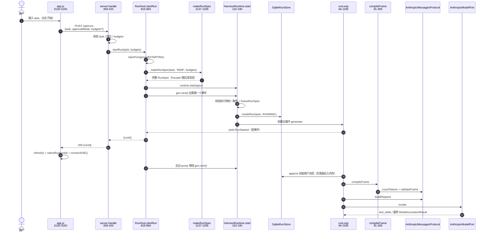
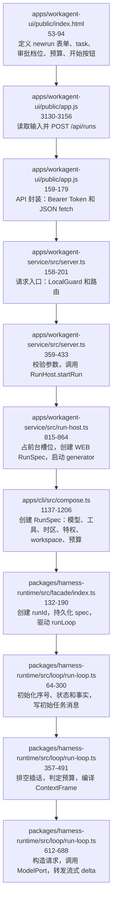
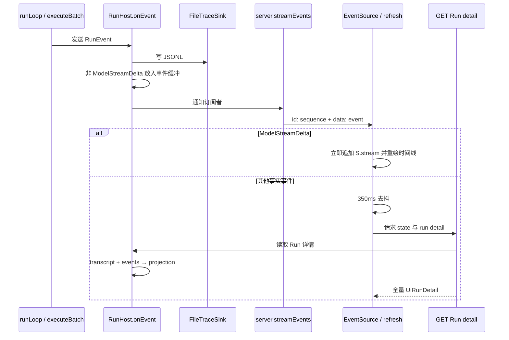

# 02. 从网页版白屏提交任务到 Run 启动

本章只跟踪一件事：在白盒网页的“新任务”文本框中输入任务并点击“开始”后，代码如何走到第一轮模型调用。先建立这条纵向链，再读横向机制。

## 1. 一句话链路

```text
index.html 表单
→ app.js submit handler
→ POST /api/runs
→ server.handle()
→ RunHost.startRun()
→ compose.makeRunSpec()
→ HarnessRuntime.start()
→ runLoop()
→ compileFrame()
→ protocol.buildRequest()
→ model.invoke()
```

## 2. 核心时序图



这里有一个容易忽略的异步技巧：HTTP 并不等待整个 Run 完成。`RunHost.drive()` 只等待 generator 的第一个事件拿到 `runId`，随后把剩余迭代放进后台 Promise。见 [`run-host.ts:1033-1127`](../../apps/workagent-service/src/run-host.ts#L1033-L1127)。

## 3. 源码调用栈图（含行号）



这张图是第一次阅读时应反复对照的“主干”。其余文档都是把其中一个节点展开。

## 4. 第 0 段：服务如何启动并把页面送出来

`npm run ui` 指向 `tsx apps/workagent-service/src/main.ts`。入口流程：

1. 解析并严格校验 CLI 参数，见 [`main.ts:99-114`](../../apps/workagent-service/src/main.ts#L99-L114)；
2. 从“显式参数 > 注册表 active > 默认目录”选 workspace；
3. 在任何 Run 之前连接 MCP 并完成 `tools/list`，见 [`main.ts:119-135`](../../apps/workagent-service/src/main.ts#L119-L135)；
4. `startService()`，注入 endpoint、审批档位、执行特权、MCP 和预算默认值，见 [`main.ts:137-157`](../../apps/workagent-service/src/main.ts#L137-L157)；
5. 打印带随机会话 Token 的 loopback URL。

`startService()` 创建 `WorkspaceHosts` 和 Node HTTP server，只监听 `127.0.0.1`，见 [`server.ts:96-153`](../../apps/workagent-service/src/server.ts#L96-L153)。

浏览器第一次 GET `/` 时，静态壳不要求 Token，否则 CSS/JS 子请求会 401，页面真的变成白纸；API 仍要求 Token。分层校验见 [`server.ts:169-200`](../../apps/workagent-service/src/server.ts#L169-L200)。

## 5. 第 1 段：页面表单与前端命令

### HTML 只是声明控件

“新任务”区域在 [`index.html:53-94`](../../apps/workagent-ui/public/index.html#L53-L94)：

- `#task`：自然语言目标；
- `#approvalmode`：进程级审批档位的同一个开关；
- `#budgetbox`：逐 Run 预算覆盖；
- `#startbtn`：提交。

UI 没有框架，没有 ViewModel 类。它通过 `document.getElementById("newrun").addEventListener("submit", ...)` 接管提交。

### submit handler 做什么

[`app.js:3130-3156`](../../apps/workagent-ui/public/app.js#L3130-L3156) 的顺序：

1. `preventDefault()`；
2. 读取并 trim `task`；
3. 读取审批档位与只填写了的预算项；
4. 调用 `api("/api/runs", { method: "POST", body: ... })`；
5. 成功后清空输入、全量刷新、选择新 Run。

统一 `api()` 封装在 [`app.js:159-179`](../../apps/workagent-ui/public/app.js#L159-L179)：普通 API 使用 `Authorization: Bearer <TOKEN>`，JSON body 自动序列化，非 2xx 转成 Error。

注意 Token 的生命周期：它从 URL 读取一次后立刻从地址栏移除并放进 `sessionStorage`，见 [`app.js:24-41`](../../apps/workagent-ui/public/app.js#L24-L41)。这是会话状态，不落盘。

## 6. 第 2 段：HTTP 路由先验证，再改变状态

所有请求先经过 [`server.ts:158-201`](../../apps/workagent-service/src/server.ts#L158-L201)：

- `LocalGuard` 校验 Host 必须是 loopback 字面量；
- 有 Origin 时必须同源；
- `/api/*` 必须带会话 Token；
- 非 API GET 才走静态文件。

`POST /api/runs` 的核心在 [`server.ts:359-433`](../../apps/workagent-service/src/server.ts#L359-L433)。阅读时特别注意**校验顺序**：

1. 任务不能为空；
2. 审批档位值先解析；
3. budgets 必须是对象，并用 Runtime 的同一个 `applyBudgetOverrides()` 试算；
4. 一切合法后才调用 `host().startRun(task, budgets)`；
5. Run 成功启动后，才拨进程级审批档位。

为什么审批档位在最后才改？如果当前已有 Run A，用户从另一个标签提交 Run B 并选择 AUTO，B 会被单前台闸门拒绝。若先改档位，**一个失败的 B 请求会悄悄把正在跑的 A 改成 AUTO**。源码注释在 [`server.ts:376-391`](../../apps/workagent-service/src/server.ts#L376-L391) 给出了完整反例。

这是 Atlas 很典型的组合安全原则：**失败的请求不得留下状态变化。**

## 7. 第 3 段：RunHost 把长任务变成后台执行

[`RunHost.startRun()`](../../apps/workagent-service/src/run-host.ts#L815-L864) 做四件关键事：

1. `claimForeground(STARTING)` 同步占住唯一前台槽位，避免两个并发 POST 都通过检查；
2. `makeRunSpec(task, "WEB", budgetOverrides)`，明确入口身份是 WEB；
3. 把尚未知道 runId 的 spec 临时放到 `pendingSpec`，保证第一个事件到达时 Trace header 能写出正确任务和执行条件；
4. 创建 `runtime.start(spec)` generator，交给 `drive()`。

### 为什么 `STARTING` 是哨兵

runId 由 Facade 在 `start()` 内创建；但 Service 必须在 `await gen.next()` 之前就阻止第二次 start。于是它用 `"\0starting"` 表示“已经占位、runId 尚未知”。定义见 [`run-host.ts:169-170`](../../apps/workagent-service/src/run-host.ts#L169-L170)，闸门实现见 [`run-host.ts:972-1012`](../../apps/workagent-service/src/run-host.ts#L972-L1012)。

### `drive()` 的两段式消费

[`run-host.ts:1040-1127`](../../apps/workagent-service/src/run-host.ts#L1040-L1127)：

- 第一段：`await gen.next()`，拿第一个 `RunEvent` 和 runId；任何 yield 前异常必须复位 live 状态与前台槽位；
- 第二段：创建 `record.pump`，在后台持续 `gen.next()` 直到 done；HTTP 可以立即返回 runId。

`LiveRun` 同时保存 AbortController、进程内事件缓冲、后台 pump、结算结果、Trace sink 等，结构见 [`run-host.ts:112-160`](../../apps/workagent-service/src/run-host.ts#L112-L160)。

## 8. 第 4 段：RunSpec 是本次执行的冻结合同

`makeRunSpec()` 位于 [`compose.ts:1137-1206`](../../apps/cli/src/compose.ts#L1137-L1206)。它把以下信息冻结：

- `origin.kind = WEB` 与任务文本；
- AgentSpec：模型、system prompt、时区、执行特权、工具快照、Context/Loop/Approval policy；
- endpoint profile 快照；
- workspace 身份和 writable mount；
- 三层合并后的预算：默认值 ← 启动参数 ← 本次提交；
- 创建时刻。

`RunSpec` 的类型定义在 [`types/run.ts:268-291`](../../packages/harness-runtime/src/types/run.ts#L268-L291)。

学习时要把它理解为“可恢复执行的合同”，不是普通配置对象。resume 不能重新调用 `makeRunSpec()`；它必须从数据库读回旧的冻结版本。

## 9. 第 5 段：Facade 创建 Run 并进入主循环

[`HarnessRuntime.start()`](../../packages/harness-runtime/src/facade/index.ts#L132-L190) 的执行顺序：

1. 生成 `runId`，创建进程内 `RunInterrupts`；
2. 在写库前检查 `RunSpec` 的执行特权与当前装配一致；
3. 深冻结 spec；
4. `runs.createRun()` 将 AgentSpec、RunSpec 和 Run 行放在同一 SQLite 事务中；
5. 构造 `runLoop()`；
6. 对每个事件先更新 WAITING 状态投影，再向调用方 yield；
7. generator 完成后将 Terminal 映射成 RunStatus；
8. finally 中释放本进程 running 标记。

这层叫 Facade，因为 Service/CLI/Eval 都只应从这里 start、resume、cancel、interject、inspect、list，不直接操纵 loop 内部状态。

## 10. 第 6 段：第一轮如何开始

`runLoop()` 在 [`run-loop.ts:64-237`](../../packages/harness-runtime/src/loop/run-loop.ts#L64-L237) 初始化：

- 冻结工具快照构成 `ToolRegistry`；
- 事件和 transcript 共用一个持久化序号分配器；
- `appendAndPush()` 强制“先落盘，后进内存”；
- 从 resume facts 或零值初始化 Verification、Recovery、ArtifactCheck 和 BudgetUsage；
- 初始化 active wall-clock、DriftDetector、ProgressGuard 与完整 `LoopState`。

首次 start（不是 resume）时会：

1. yield `RunStarted`；
2. 把用户任务作为 turn 0 的 `ContextMessage` 写入 transcript；
3. 进入 `while(true)`。

对应 [`run-loop.ts:281-300`](../../packages/harness-runtime/src/loop/run-loop.ts#L281-L300)。

第一轮循环随后：

- 排空插话；
- 检查八条预算轴；
- yield `TurnStarted`；
- 调用 `compileFrame()`；
- 由 Protocol 生成请求；
- 由 ModelPort 发出流式请求。

核心位置是 [`run-loop.ts:357-491`](../../packages/harness-runtime/src/loop/run-loop.ts#L357-L491) 与 [`run-loop.ts:612-688`](../../packages/harness-runtime/src/loop/run-loop.ts#L612-L688)。

## 11. 事件如何回到网页



生产点：`RunHost` 将自己的 `onEvent()` 作为 Trace sink 注入 `compose()`，见 [`run-host.ts:220-253`](../../apps/workagent-service/src/run-host.ts#L220-L253)。

扇出点：[`run-host.ts:1183-1207`](../../apps/workagent-service/src/run-host.ts#L1183-L1207)。流式 delta 只实时转发，不进重连缓冲；完整正文最终存在 transcript。

SSE 服务端：[`server.ts:561-597`](../../apps/workagent-service/src/server.ts#L561-L597)。SSE `id` 就是统一 `sequence`，浏览器重连通过 `Last-Event-ID` 续接。

SSE 客户端：[`app.js:3079-3100`](../../apps/workagent-ui/public/app.js#L3079-L3100)。只有文字 delta 在本地即时合并，其余事件触发全量刷新。

全量刷新：[`app.js:3013-3045`](../../apps/workagent-ui/public/app.js#L3013-L3045)。它带 runId 竞态 guard，避免先请求 A、切到 B 后 A 的慢响应覆盖 B 的详情。

## 12. 本章第一次源码实走建议

按以下顺序在 IDE 中打开，不要跳：

1. `index.html:53`；
2. `app.js:3130`；
3. `server.ts:359`；
4. `run-host.ts:815`；
5. `compose.ts:1137`；
6. `facade/index.ts:132`；
7. `run-loop.ts:281`；
8. `run-loop.ts:359`；
9. `run-loop.ts:469`；
10. `run-loop.ts:613`。

每到一处只回答一个问题：**这一层新增加了什么事实或闸门？**

- UI 增加的是用户输入；
- server 增加的是合法性验证；
- RunHost 增加的是进程生命周期与后台驱动；
- makeRunSpec 增加的是冻结执行合同；
- Facade 增加的是 Run 身份、持久化和生命周期；
- runLoop 增加的是迭代执行语义；
- Context/Protocol 增加的是可发送且协议合法的请求。

读完后，再进入下一章展开 `runLoop → executeBatch → next turn/finish`。
