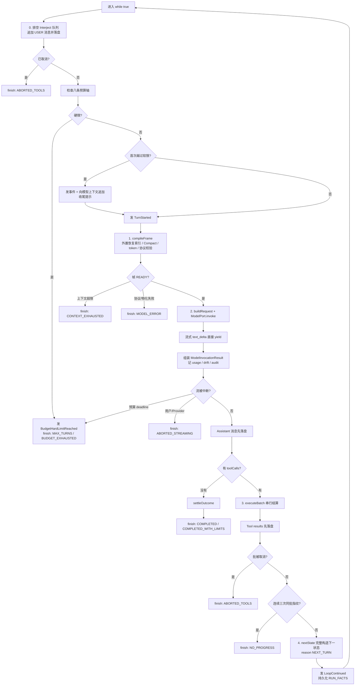
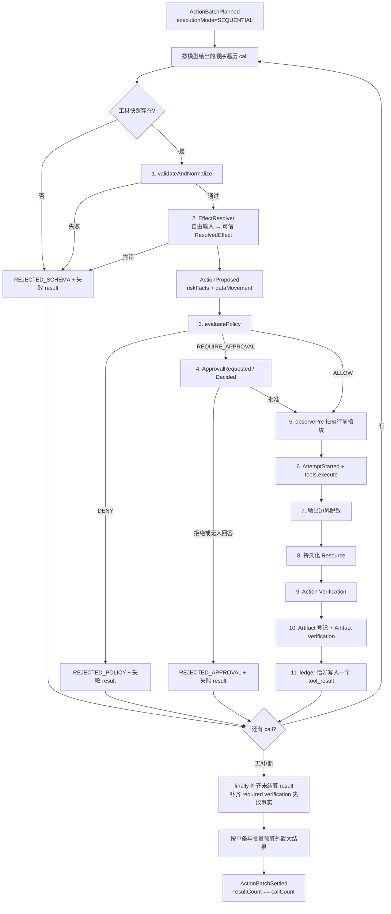

# 03. Harness 主循环与 ActionBatch

## 1. 主循环是 Atlas 的心脏

[`runLoop()`](../../packages/harness-runtime/src/loop/run-loop.ts#L64-L66) 是 Agent 行为真正发生的地方。它不是“不断问模型直到模型不说话”的简单循环，而是一台带持久化、预算、协议、恢复、验证和具名终态的状态机。

文件头列出了五条循环纪律，见 [`run-loop.ts:1-16`](../../packages/harness-runtime/src/loop/run-loop.ts#L1-L16)：

1. 每个 continue 站点构造完整 `LoopState`；
2. 每个 continue 和 return 都有具名原因；
3. 消息先落盘，再进入内存数组；
4. delta、进度、心跳直接 yield，不塞进 `LoopState`；
5. 主循环不读取具体端点能力声明。

这五条比某一行实现更重要。读任何分支时都应检查它们是否仍成立。

## 2. 主循环流程图



对应主代码从 [`run-loop.ts:357`](../../packages/harness-runtime/src/loop/run-loop.ts#L357) 开始，到 [`run-loop.ts:1194`](../../packages/harness-runtime/src/loop/run-loop.ts#L1194) 结束。

## 3. LoopState：可丢弃的进程内状态

[`LoopState`](../../packages/harness-runtime/src/types/loop.ts#L18-L30) 包含：

- `messages`：当前生效的上下文消息；
- `turnCount` 与 `consecutiveFailures`；
- `budgetUsage`；
- 输出预算恢复时临时抬高的 `maxOutputTokensOverride`；
- 模型错误重试与输出上限恢复计数；
- 上一次具名 `transition`。

它刻意不要求可序列化。进程崩溃后不会从它恢复，而是从 transcript 重建消息，再从最后一条 `RUN_META` 读回不可反推的累计事实。

[`nextState()`](../../packages/harness-runtime/src/types/loop.ts#L93-L105) 是所有 continue 的统一入口：它继承完整旧状态，只允许显式 patch，并强制提供 `Continue`。当前只有三个 continue 原因：

- `NEXT_TURN`；
- `OUTPUT_LIMIT_RECOVERY`；
- `MODEL_ERROR_RETRY`。

如果有人往 `Continue` 联合里加一个值，却找不到实际 `nextState()` 调用点，它就是“零生产者声明”。

## 4. 事件与 transcript 的统一序号

主循环中的 `emit()` 在 [`run-loop.ts:71-89`](../../packages/harness-runtime/src/loop/run-loop.ts#L71-L89)，消息持久化的 `appendAndPush()` 在 [`run-loop.ts:91-114`](../../packages/harness-runtime/src/loop/run-loop.ts#L91-L114)。两者都向同一个 `TranscriptStorePort.nextSequence()` 取号。

因此一次典型轮次的序号可能是：

```text
21  RunEvent TurnStarted                 （不在 transcript 表）
22  RunEvent ContextFrameCompiled        （不在 transcript 表）
23  RunEvent ModelInvocationCompleted    （不在 transcript 表）
24  Transcript MESSAGE assistant         （在 transcript 表）
25  RunEvent ActionBatchPlanned
26  RunEvent ActionProposed
...
34  Transcript MESSAGE tool results
35  RunEvent LoopContinued
36  Transcript RUN_META
```

transcript 的 sequence 有空洞是正常的：空洞表示中间发生过事件。这使 Layer 2 可以把两条轨道全序合并。

## 5. 预算算法

主循环在每轮顶部构造最新 active wall-clock 并调用 [`checkBudgets()`](../../packages/harness-runtime/src/budget/index.ts#L117-L144)，消费点在 [`run-loop.ts:381-427`](../../packages/harness-runtime/src/loop/run-loop.ts#L381-L427)。

八条轴：

1. turns；
2. active wall-clock；
3. total wall-clock；
4. model calls；
5. tool calls；
6. billed input tokens；
7. output tokens；
8. consecutive failures。

权威轴表在 [`budget/index.ts:202-259`](../../packages/harness-runtime/src/budget/index.ts#L202-L259)。`checkBudgets()` 先遍历全部轴找 HARD，再找 SOFT，防止同一轮既过软限又到硬限时“只提醒不停机”。

### active wall-clock 如何排除等待

[`run-loop.ts:141-174`](../../packages/harness-runtime/src/loop/run-loop.ts#L141-L174) 的公式：

```text
active = 上段继承累计值
       + 当前执行段运行时长
       - 已闭合等待时长
       - 当前仍未闭合的等待时长
```

审批由 `ApprovalRequested / ApprovalDecided` 夹出等待；人工接管由 `InteractionRequested / InteractionCompleted` 夹出等待，消费点在 [`run-loop.ts:1033-1065`](../../packages/harness-runtime/src/loop/run-loop.ts#L1033-L1065)。

模型调用本身还挂了剩余 active 预算的 deadline，见 [`run-loop.ts:642-672`](../../packages/harness-runtime/src/loop/run-loop.ts#L642-L672)。否则一条模型调用可以单独越过整个墙钟上限，而循环顶部来不及再检查。

## 6. 模型调用与三种恢复

请求和流式消费在 [`run-loop.ts:612-790`](../../packages/harness-runtime/src/loop/run-loop.ts#L612-L790)。几个重要分支：

- 模型调用 deadline：统一结算为 `BUDGET_EXHAUSTED`，不能伪装成用户取消；
- Provider/SDK 错误：先由 Protocol 分类；`SAME_INPUT_BACKOFF` 最多按 LoopPolicy 重试；
- `stop_reason=max_tokens` 且没有正文/工具调用：识别为推理吃光输出预算，最多抬高 `max_tokens` 重试；
- 流被中断但已收到闭合 tool call：为每个未执行 call 合成 `NOT_STARTED` result，保持配对不变量；
- Endpoint 行为与声明漂移：按 disposition 记录或 fail-fast。

模型完整结果记账在 [`run-loop.ts:792-879`](../../packages/harness-runtime/src/loop/run-loop.ts#L792-L879)，特别注意 token 口径使用 `billedInputTokens` 比对漂移并累计预算。

## 7. “模型不再请求工具”如何完成

Assistant 消息先落盘，见 [`run-loop.ts:962-971`](../../packages/harness-runtime/src/loop/run-loop.ts#L962-L971)。如果 `toolCalls.length === 0`：

1. 增加 turn 与 budget usage；
2. 使用既有 Verification/Artifact 事实算 outcome kind；
3. 走统一 `finish()`；
4. 发 `LoopTerminated`；
5. 持久化最终 RUN_FACTS。

对应 [`run-loop.ts:973-993`](../../packages/harness-runtime/src/loop/run-loop.ts#L973-L993)。

这里要理解一个当前边界：**自然语言目标是否完整满足，Runtime 没有独立验收契约。** “模型不再请求工具”决定何时退出；事实表决定退出后是 SUCCESS、COMPLETED_WITH_LIMITS、USER_REJECTED 或 FAILED 等。正式能力正确性仍由独立 Eval grader 判断。

## 8. ActionBatch 流程图

`executeBatch()` 从 [`settle-batch.ts:133`](../../packages/harness-runtime/src/action/settle-batch.ts#L133) 开始。每次模型响应可以带多个 tool call，但 Runtime 强制顺序执行。



## 9. ActionBatch 的核心数据结构：ledger

[`settle-batch.ts:146-169`](../../packages/harness-runtime/src/action/settle-batch.ts#L146-L169) 使用：

```ts
Map<toolCallId, ModelContent /* tool_result */>
```

作为结算台账。`settle()` 禁止同一 call 写两次；`finally` 中的 `finalize()` 为取消、跳过或异常留下的所有 call 补齐 result，见 [`settle-batch.ts:984-1009`](../../packages/harness-runtime/src/action/settle-batch.ts#L984-L1009)。最终 `results` 按原始 `calls` 顺序映射，见 [`settle-batch.ts:1080-1096`](../../packages/harness-runtime/src/action/settle-batch.ts#L1080-L1096)。

它强制不变量：

```text
每个 tool_call 恰好一个 tool_result
result.toolCallId 与原 call 相同
结果顺序与模型给出的 call 顺序相同
```

Provider 不一定替 Atlas 检查这些，所以 Runtime 必须自持。

## 10. 一次 Action 的十一站

| 站点 | 源码 | 关键问题 |
|---|---|---|
| 计划 | [`settle-batch.ts:187-201`](../../packages/harness-runtime/src/action/settle-batch.ts#L187-L201) | 批恒为串行 |
| schema | [`settle-batch.ts:235-258`](../../packages/harness-runtime/src/action/settle-batch.ts#L235-L258) | 工具存在吗、参数结构合法吗 |
| Effect | [`settle-batch.ts:260-290`](../../packages/harness-runtime/src/action/settle-batch.ts#L260-L290) | 真正副作用的目标和类型是什么 |
| 事件 | [`settle-batch.ts:292-312`](../../packages/harness-runtime/src/action/settle-batch.ts#L292-L312) | 风险与数据流向能否被审计 |
| Policy | [`settle-batch.ts:314-332`](../../packages/harness-runtime/src/action/settle-batch.ts#L314-L332) | 允许、拒绝还是需审批 |
| Approval | [`settle-batch.ts:334-412`](../../packages/harness-runtime/src/action/settle-batch.ts#L334-L412) | 谁决定的；无人回答不能冒充用户拒绝 |
| 执行前观察 | [`settle-batch.ts:414-451`](../../packages/harness-runtime/src/action/settle-batch.ts#L414-L451) | 为崩溃恢复留下前置指纹 |
| 执行 | [`settle-batch.ts:453-665`](../../packages/harness-runtime/src/action/settle-batch.ts#L453-L665) | 超时、取消、人工等待、副作用状态 |
| 脱敏/Resource | [`settle-batch.ts:667-730`](../../packages/harness-runtime/src/action/settle-batch.ts#L667-L730) | 什么内容允许进入持久化/模型上下文 |
| Action 验证 | [`settle-batch.ts:731-794`](../../packages/harness-runtime/src/action/settle-batch.ts#L731-L794) | 这一步的外部效果是否达成 |
| Artifact 验证 | [`settle-batch.ts:796-937`](../../packages/harness-runtime/src/action/settle-batch.ts#L796-L937) | 交付物本身是否完整合法 |
| 结算与外置 | [`settle-batch.ts:939-1096`](../../packages/harness-runtime/src/action/settle-batch.ts#L939-L1096) | 生成唯一 result，大内容是否变成 ResourceRef |

## 11. 为什么必须串行执行工具

`ActionBatch.executionMode` 是单值类型 `"SEQUENTIAL"`，定义在 [`types/tool.ts:395-407`](../../packages/harness-runtime/src/types/tool.ts#L395-L407)。

原因不是端点总能关闭并行。相反，端点对“关闭并行工具调用”开关可能静默接受但不生效。Atlas 接受模型一次产出多个 call，但 Runtime 自己逐个执行，确保：

- 审批顺序确定；
- 前一个副作用与后一个调用不会并发竞争；
- result 顺序稳定；
- crash 窗口更易解释。

## 12. Progress Guard

每批完成后，主循环用 `(toolName, normalized input digest, resolved effect digest)` 形成批指纹，见 [`run-loop.ts:1090-1103`](../../packages/harness-runtime/src/loop/run-loop.ts#L1090-L1103)。

[`ProgressGuard.observeBatch()`](../../packages/harness-runtime/src/loop/progress-guard.ts#L73-L118) 将一批多个 Action 合并为一个指纹；连续第 3 次完全相同则返回 `NoProgressVerdict`。随后主循环先落 tool results，再具名终止为 `NO_PROGRESS`，见 [`run-loop.ts:1118-1140`](../../packages/harness-runtime/src/loop/run-loop.ts#L1118-L1140)。

它只检测原地打转，不检测执行中的长工具是否还活着。当前工具进度要等 `tools.execute()` 返回后才能从队列 yield，不能作为真实时间心跳。

## 13. Outcome 结算优先级

[`settleOutcome()`](../../packages/harness-runtime/src/verification/settle-outcome.ts#L42-L135) 的核心优先级：

1. 最终 DELIVERABLE 检查失败 → `FAILED`；
2. 有未知/部分副作用 recovery items → `COMPLETED_WITH_LIMITS`；
3. required Verification 全通过且无中间产物失败 → `SUCCESS`；
4. 只有中间产物检查失败 → `COMPLETED_WITH_LIMITS`；
5. 所有未达成 required 项都来自人类明确拒绝 → `USER_REJECTED`；
6. 混合或其他未达成原因 → `COMPLETED_WITH_LIMITS`。

预算、上下文、配额、取消、模型故障等“撞墙”出口走 [`settleWallOutcome()`](../../packages/harness-runtime/src/verification/settle-outcome.ts#L254-L287)，用已落盘事实生成确定性 handoff，不再额外调用模型写漂亮总结。

## 14. 本章阅读检查

你应能解释：

1. 为什么 `LoopState` 不落盘，但预算又能跨进程继承？
2. 为什么 tool call 的多个 result 不能靠数组长度事后检查，而要用 ledger 逐条结算？
3. 为什么工具执行成功仍可能导致 Run 的 outcome 不是 SUCCESS？
4. 为什么审批拒绝与无人回答必须用不同 `unmetCause`？
5. 为什么 ToolProgress 目前不能用于“长工具仍活着”的判断？

建议验证：

```bash
npm run verify:pairing
npm run verify:budget
npm run verify:progress
npm run verify:artifact
```

