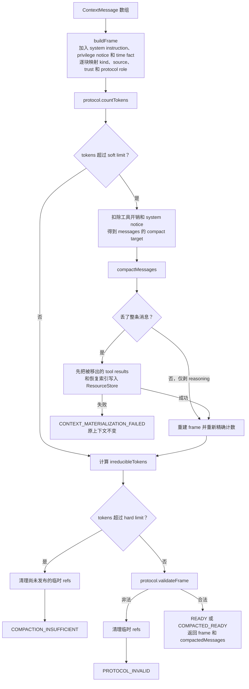

# 04. 上下文编译、模型调用与 Compact

## 1. 这条链解决什么问题

模型看到的不是 transcript 原始行，也不是简单的 `messages` 数组。每轮必须把当前消息编译成一个带来源、信任、协议角色、token 预算和内容 hash 的 `ContextFrame`，再由形状适配器翻译成 Anthropic Messages 请求。

主链：

```text
ContextMessage[]
→ compileFrame()
→ ContextItem[] / ContextFrame
→ ModelProtocolPort.countTokens()
→ 必要时 compactMessages()
→ ModelProtocolPort.validateFrame()
→ ModelProtocolPort.buildRequest()
→ ModelPort.invoke()
→ ModelInvocationResult
```

## 2. Context 数据模型

### `ContextMessage`

定义在 [`types/transcript.ts:21-38`](../../packages/harness-runtime/src/types/transcript.ts#L21-L38)。它是会进入上下文的一条恢复级消息：

- `role` 是 Provider 协议载体；
- `origin` 才是来源事实：USER / MODEL / TOOL / RUNTIME；
- `content` 是规范化块；
- `turn` 用于定位；
- Runtime Compact 摘要可携带 `recoveryIndexRefs`。

重要区别：Anthropic 形状下 tool result 和 Runtime notice 都可能使用 user role，但它们不是用户输入。所以所有来源判断都必须读 `origin`，不能读 `role` 或提示文案。

### `ModelContent`

定义在 [`types/context.ts:61-73`](../../packages/harness-runtime/src/types/context.ts#L61-L73)：

- `text`；
- `reasoning`；
- `tool_call`；
- `tool_result`，可带结构化 `resourceRefs`。

这是 Runtime 与形状适配器之间的中性内容语言。

### `ContextItem` 与 `ContextFrame`

[`ContextItem`](../../packages/harness-runtime/src/types/context.ts#L75-L87) 给每个内容块附加：

- `kind`；
- `source`；
- `trust`；
- `protocolRole`；
- `protocolGroupId`；
- content hash、估算 token、时间。

[`ContextFrame`](../../packages/harness-runtime/src/types/context.ts#L89-L111) 是一次模型调用的完整、不可分割输入，带 frameId、invocationId、端点声明版本、总 token、不可压缩 token、固定工具开销、输出预留与 trust summary。

## 3. compileFrame 流程图



入口和完整返回类型见 [`compile.ts:91-309`](../../packages/harness-runtime/src/context/compile.ts#L91-L309)。

## 4. 首次成帧

`buildFrame()` 在 [`compile.ts:418`](../../packages/harness-runtime/src/context/compile.ts#L418) 附近。它按稳定前缀优先的次序构造：

1. system instruction；
2. UNRESTRICTED 时的更正性安全事实；
3. 本执行段冻结的当前时间事实；
4. transcript 重建出的消息内容。

每个消息块通过 `kindOf()`、`sourceOf()`、`trustOf()` 映射，再调用 `protocol.protocolRoleOf(item)` 让形状 + 端点声明决定协议保护档位，消费点见 [`compile.ts:504-519`](../../packages/harness-runtime/src/context/compile.ts#L504-L519)。

`ContextTrust` 有四档：SYSTEM_TRUSTED、USER_PROVIDED、MODEL_GENERATED、EXTERNAL_UNTRUSTED。当前 Policy 不用 trust 做 Allow/Deny；它作为审计事实进入 `ContextFrameCompiled` 事件。

## 5. Compact 算法的真正难点

Compact 不是把旧消息截掉或让模型总结。当前算法有四个核心约束：

1. 优先剥离允许丢弃的 reasoning 块；
2. tool call 与对应 result 必须作为不可拆分协议单元一起保留或一起移出；
3. 第一条真实用户目标、所有真实用户输入、最近两轮和协议要求内容必须保留；
4. 从最旧的可丢协议单元开始逐个丢，达到目标即停，不一次性删光。

实现入口是 [`compact.ts:64-228`](../../packages/harness-runtime/src/context/compact.ts#L64-L228)。

### 为什么要用并查集

`protocolUnits()` 在 [`compact.ts:230-281`](../../packages/harness-runtime/src/context/compact.ts#L230-L281) 使用并查集，把共享同一个 `toolCallId` 的消息索引合并。

例如：

```text
assistant [tool_call A, tool_call B]
user      [tool_result A]
user      [tool_result B]
```

A 和 B 通过同一条 assistant 消息产生传递关联，所以三条消息必须是一个单元。只按 `toolCallId` 分两个组，会在丢 A 时留下孤儿 B。

并查集状态：

```text
parent[i] = 消息 i 所属集合的代表
firstSeen[toolCallId] = 第一次见到该锚点的消息索引
再次见到同一 toolCallId → union(previous, current)
最后按 root 聚合，并按最旧索引排序
```

这是本项目最典型、最值得单独手画一次的数据结构算法。

### 保护规则

[`compact.ts:109-146`](../../packages/harness-runtime/src/context/compact.ts#L109-L146)：

- 第一条 `origin === USER` 的文本消息永远保留；
- 所有真实用户输入永远保留；
- 最近两个**去重后的轮号**保留；
- 端点要求 reasoning 占位/原文时相应消息保留；
- 协议单元中任一消息被保护，整个单元不动。

### 收敛规则

[`compact.ts:148-169`](../../packages/harness-runtime/src/context/compact.ts#L148-L169) 从最旧单元向后遍历，每移出一个单元，用本地估算减 token；达到 `targetTokens` 即停止。调用方随后用 Protocol 的真实计数路径复核。

## 6. Compact 的两阶段提交

如果 Compact 移出了包含工具结果的消息，仅把它们从上下文删掉会导致事实不可恢复。`compileFrame()` 先：

1. 为每个被移出的 tool result 创建 Resource；
2. 创建 `COMPACT_RECOVERY_INDEX`，列出 turn、toolCallId、toolName、resultRef 和原有 resourceRefs；
3. 用一条 Runtime summary 把恢复索引 ref 留在新上下文。

实现见 [`compile.ts:131-203`](../../packages/harness-runtime/src/context/compile.ts#L131-L203) 和 [`compile.ts:311-385`](../../packages/harness-runtime/src/context/compile.ts#L311-L385)。

只有 Resource 保存、新 frame 计数和协议校验都成功，主循环才把 summary + kept 作为一条 `COMPACT_BOUNDARY` 原子写进 transcript，并更新内存 `state.messages`，见 [`run-loop.ts:493-545`](../../packages/harness-runtime/src/loop/run-loop.ts#L493-L545)。

失败时临时 refs 通过 `discardUncommitted()` 清理，原上下文保持不变。这是一个小型两阶段提交：

```text
prepare：保存被移出内容与索引，但尚未发布到 transcript
validate：重建、计数、协议校验
commit：单条 COMPACT_BOUNDARY + 更新 state.messages
rollback：清理未发布 refs
```

## 7. 为什么 COMPACT_BOUNDARY 是一条原子 snapshot

一条 boundary 同时保存：

- `compactSummary`；
- `compactKept`。

主循环写入点在 [`run-loop.ts:523-531`](../../packages/harness-runtime/src/loop/run-loop.ts#L523-L531)，重建算法在 [`transcript/index.ts:21-48`](../../packages/harness-runtime/src/transcript/index.ts#L21-L48)。

如果拆成“先写 boundary，再逐条 append kept”，进程可能在中间崩溃：旧历史已经被 boundary 遮蔽，新保留集却只有一半。单条 SQLite INSERT 让恢复只能看到旧世界或完整新世界。

## 8. ModelProtocolPort：形状与端点数据的组合出口

[`ModelProtocolPort`](../../packages/harness-runtime/src/ports/index.ts#L98-L131) 的职责：

- `buildRequest(frame)`；
- `countTokens(frame)`；
- `validateFrame(frame)`；
- `protocolRoleOf(item)`；
- `classifyError(err)`；
- 只读 `profile` 供 Context 层判断。

当前实现 [`AnthropicMessagesProtocol`](../../adapters/shape-anthropic-messages/src/protocol.ts#L46-L51) 把两个来源结合起来：

| 方法 | 形状提供 | endpoint profile 提供 |
|---|---|---|
| `buildRequest` | Anthropic body、message/block 结构 | modelId、并行工具开关、缓存断点能力 |
| `validateFrame` | tool_use/result 配对、reasoning 位置 | 校验强度、reasoning rule |
| `protocolRoleOf` | 哪类块是什么 | DROPPABLE / PLACEHOLDER / VERBATIM |
| `countTokens` | count_tokens 请求形状 | 是否有接口、精度、基础 token、reasoning 是否漏算 |
| `classifyError` | SDK/HTTP 事实提取 | 错误判别式 |

主循环只调用 Port，不出现“如果是百炼则……”的分支。

## 9. buildRequest 与前缀缓存

[`protocol.ts:55-137`](../../adapters/shape-anthropic-messages/src/protocol.ts#L55-L137) 将 ContextItem 翻译为 Anthropic 消息并构造 body。

若 profile 声明支持显式缓存断点：

- system block 上打一个稳定断点；
- 当前 messages 最后一个 block 上打一个断点。

原因是第 N 轮消息通常是第 N+1 轮的严格前缀。Compact 会改写历史前缀并导致失效，但下一轮在新末尾自动重建断点。

工具定义从冻结的 `ToolSnapshot[]` 转成 `name + description + input_schema`。工具数本身形成固定 token 开销，`ToolRegistry.fixedOverheadTokens()` 以约 180 token/工具估算，见 [`tool-runtime/index.ts:30-38`](../../packages/harness-runtime/src/tool-runtime/index.ts#L30-L38)。

## 10. token 计数

[`protocol.ts:141-178`](../../adapters/shape-anthropic-messages/src/protocol.ts#L141-L178)：

- profile 声明有 count_tokens 且调用成功 → 使用端点结果；
- 若端点 count_tokens 不计 reasoning → 本地补 reasoning 估算，并把精度降为 ESTIMATED；
- 端点调用失败或无接口 → 本地按字符估算，加固定工具开销与 per-request base tokens。

`compileFrame()` 用这个数字同时做 soft/hard 阈值判断；漂移检测则把 `frame.totalTokens` 与真实 `usage.billedInputTokens` 比较。

## 11. ModelPort：网络流与块组装

[`AnthropicModelPort.invoke()`](../../adapters/shape-anthropic-messages/src/client.ts#L55-L168) 是唯一导入 Anthropic SDK 的生产路径。它：

1. 发 streaming 请求，透传 AbortSignal；
2. 将 SDK 解码后的 Provider 事件送到独立审计 observer；
3. 维护 `Map<blockIndex, PartialBlock>`；
4. 只把 `text_delta` yield 给 Runtime；reasoning、signature、tool JSON 在适配器内累积；
5. 合并分散在 message_start/message_delta 的 usage；
6. 中断时标记 `interrupted`；
7. 调用 `assemble()` 返回中性 `ModelInvocationResult`。

### 未闭合工具调用为什么不进入 Runtime

[`assemble()`](../../adapters/shape-anthropic-messages/src/client.ts#L205-L246) 只把“块已闭合且 partial JSON 可解析”的 `tool_use` 转成 `tool_call`。半截 tool JSON 或未闭合块会被丢弃，避免把不完整意图变成 `ProposedAction`。

闭合规则由 endpoint profile 决定：有明确 close event 就看 `block.closed`；否则用“后继 index 已出现”作为前一块闭合证据。

## 12. 模型调用审计为什么独立

每次请求前，主循环创建 `FailOpenModelInvocationAudit`，见 [`run-loop.ts:612-640`](../../packages/harness-runtime/src/loop/run-loop.ts#L612-L640)。它记录：

- 实际 request body；
- SDK 解码后的 Provider events；
- Provider/transport failure；
- Runtime 规范化结果或中断原因。

这些敏感数据不进入 transcript、SQLite 主事实或 Trace，而写进 `<workspace>/.workagent/model-invocations/<runId>/<invocationId>.jsonl` sidecar。审计写失败只发 `ModelInvocationAuditFailed`，不能改变模型调用与 Run 结果。

## 13. 本章阅读检查

1. `role=user` 为什么不能证明这条消息来自用户？
2. Compact 为什么要并查集，而不是按消息或 toolCallId 简单分组？
3. 为什么被移出的结果必须先写 Resource，再提交 boundary？
4. `ModelProtocolPort` 与 `ModelPort` 为什么要分开？
5. 为什么主循环只接收 text delta，却仍然能得到 reasoning 和 tool call 的完整最终结果？

建议验证：

```bash
npm run verify:compact
npm run verify:endpoint-profile
npm run probe:reasoning-tokens
npm run verify:model-audit
```
