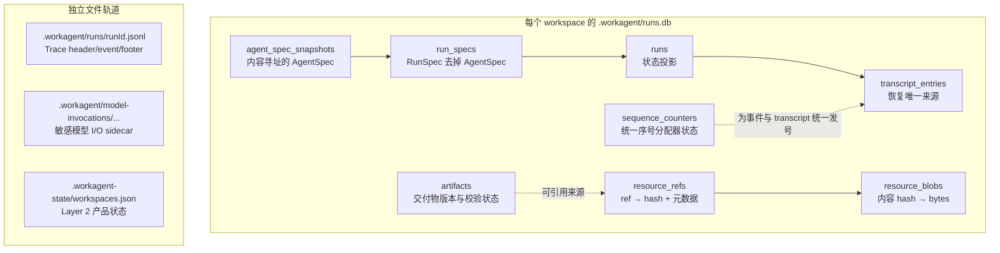
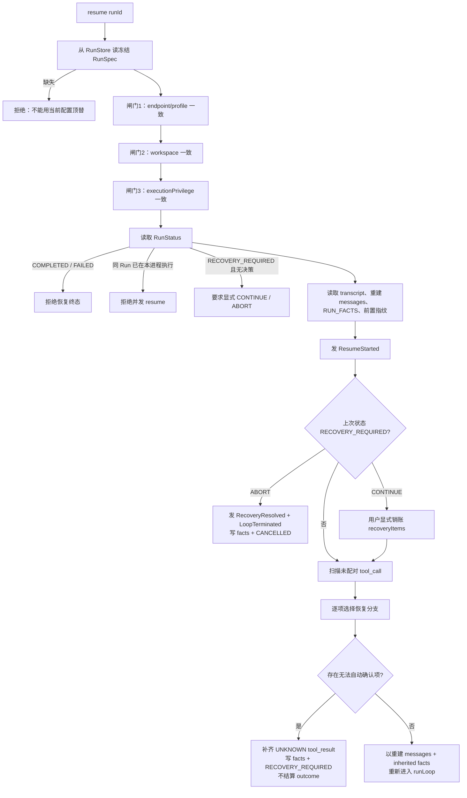
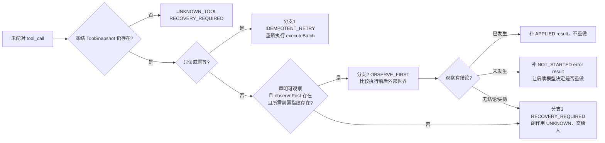

# 05. 持久化、恢复与一致性

## 1. 恢复模型的核心选择

Atlas 选择的是**消息级恢复**：

```text
resume(runId)
= 读回启动时冻结的 RunSpec
+ 读 transcript
+ 从最后一个 Compact boundary 重建 messages
+ 读最后一条 RUN_META 恢复累计事实
+ 扫描未配对 tool_call
+ 按幂等性与可观察性选择恢复分支
+ 从下一轮继续
```

它不保存/恢复 `LoopState` 快照，不用 RunEvent 重放恢复，也不承诺 mid-turn 精确续跑。这是系统复杂度和副作用风险之间的核心取舍。

## 2. 持久化全景与事实所有权



数据库 DDL 的唯一来源是 [`store-sqlite/src/db.ts:74-277`](../../packages/store-sqlite/src/db.ts#L74-L277)。

## 3. SQLite 表怎么读

### `agent_spec_snapshots`

- 主键是序列化 AgentSpec 的 SHA-256 内容 hash；
- 相同执行体快照可以跨 Run 复用；
- 工具声明、模型、prompt、时区、执行特权和 policy 都在这里。

DDL 见 [`db.ts:74-93`](../../packages/store-sqlite/src/db.ts#L74-L93)。

### `run_specs`

- 存 `RunSpec` 除 AgentSpec 外的字段；
- 通过 `agent_spec_content_hash` 指向唯一 AgentSpec；
- 避免同一份 AgentSpec 在两个 JSON 字段中成为两份权威。

DDL 见 [`db.ts:94-111`](../../packages/store-sqlite/src/db.ts#L94-L111)。

### `runs`

- `run_id → run_spec_id`；
- 额外保存 task 便于列表查询；
- `status` 是生命周期投影，支撑 RECOVERY_REQUIRED/WAITING 等界面语义；
- 它不是恢复上下文的来源。

DDL 见 [`db.ts:112-132`](../../packages/store-sqlite/src/db.ts#L112-L132)。

### `transcript_entries`

- 主键 `(run_id, sequence)`；
- append-only；
- `payload_json` 按 kind 保存 message、compact snapshot 或 meta；
- 种类只有 RUN_META、MESSAGE、COMPACT_BOUNDARY、ACTION_FACT。

DDL 见 [`db.ts:133-159`](../../packages/store-sqlite/src/db.ts#L133-L159)，类型见 [`types/transcript.ts:40-66`](../../packages/harness-runtime/src/types/transcript.ts#L40-L66)。

### `sequence_counters`

- 持久化每个 Run 已分配到的高水位；
- 事件与 transcript 条目都从它取号；
- 与 `RUN_META.lastSequence` 不是重复权威：前者是分配器状态，后者是已记录事实的高水位。

DDL 见 [`db.ts:160-181`](../../packages/store-sqlite/src/db.ts#L160-L181)。

### Resource 两张表

- `resource_blobs`：`content_hash → bytes`，相同字节只存一份；
- `resource_refs`：每次调用获得独立 ref 与 media type、label、文件名、脱敏处置。

DDL 见 [`db.ts:182-229`](../../packages/store-sqlite/src/db.ts#L182-L229)。

### `artifacts`

- `(logical_id, version)` 构成版本链；
- 关联来源 Run、角色、类型、path、hash、size、可选 Resource 来源、校验状态；
- 内容变化新建版本，不原地覆盖记录。

DDL 见 [`db.ts:230-276`](../../packages/store-sqlite/src/db.ts#L230-L276)。

## 4. 建库策略：current-only，拒绝静默迁移

[`openDb()`](../../packages/store-sqlite/src/db.ts#L279-L327) 的策略：

- 空库：建立所有表与索引，然后立即自校验；
- 非空库：在任何 DDL 前完整校验表、列、索引集合；
- 不一致：关闭连接并报错，要求删库重建；
- 没有 migration 机制。

这是单人本地项目的明确成本选择。损坏或旧结构若被“尽量兼容”，最危险的不是启动失败，而是预算、指纹或消息被静默解释为“从未存在”。

## 5. Run 创建的事务边界

[`SqliteRunStore.createRun()`](../../packages/store-sqlite/src/run-repository.ts#L27-L72) 在同一个事务中：

1. `INSERT OR IGNORE agent_spec_snapshots`；
2. 写 `run_specs`；
3. 写 `runs`。

进程不可能留下“列表里有 Run，但 RunSpec 缠不上”的半个对象。

读回时 [`getRunSpec()`](../../packages/store-sqlite/src/run-repository.ts#L74-L108) join 两张表并重新深冻结 JSON.parse 得到的对象。注意：内存里被冻结过的对象序列化后再 parse，会重新变成可变对象，所以读侧必须再 freeze。

## 6. transcript 如何追加与重建

[`SqliteTranscriptStore.nextSequence()`](../../packages/store-sqlite/src/transcript-store.ts#L33-L76) 在事务内取：

```text
next = max(
  sequence_counters.high_water,
  MAX(transcript_entries.sequence),
  调用方给的 atLeast
) + 1
```

然后更新高水位。

[`append()`](../../packages/store-sqlite/src/transcript-store.ts#L78-L108) 先取号、再单条 INSERT。两者不放在一个嵌套事务中；取号成功但写入失败只会留下序号空洞，而事件本来就会产生合法空洞。

[`rebuildFromEntries()`](../../packages/harness-runtime/src/transcript/index.ts#L15-L48) 的算法：

1. 按 sequence 排序；
2. 从尾部寻找最后一个 COMPACT_BOUNDARY；
3. 以 boundary 的 summary + kept snapshot 为起点；
4. 追加 boundary 后所有 MESSAGE；
5. 忽略 RUN_META/ACTION_FACT，因为它们不进入模型消息。

## 7. 三类 transcript 条目为何分开

| kind | 粒度 | 内容 | 读取者 |
|---|---|---|---|
| `MESSAGE` | 每条上下文消息 | 用户、模型、工具或 Runtime 内容 | `rebuildMessages()` |
| `RUN_META` | 每轮边界滚动聚合 | 预算、轮数、Verification、Recovery、序号、分支计数 | `readRunFacts()` |
| `ACTION_FACT` | 每个 Action | 执行前指纹 | resume 分支二 |
| `COMPACT_BOUNDARY` | 每次真正丢消息的 Compact | summary + kept 原子 snapshot | 重建起点 |

`RUN_META` 不能装 Action 指纹，因为它每轮会整体覆写语义；指纹是逐条事实。`ACTION_FACT` 不能替代 RUN_META，因为预算等是滚动累计量。数据结构反映的是粒度差异。

## 8. resume 总流程

入口是 [`HarnessRuntime.resume()`](../../packages/harness-runtime/src/facade/index.ts#L232-L761)。



### 三道一致性闸门

它们必须排在真正恢复之前：

- endpoint/profile：[`facade/index.ts:264-273`](../../packages/harness-runtime/src/facade/index.ts#L264-L273)；
- workspace：[`facade/index.ts:275-281`](../../packages/harness-runtime/src/facade/index.ts#L275-L281)；
- execution privilege：[`facade/index.ts:283-297`](../../packages/harness-runtime/src/facade/index.ts#L283-L297)。

共同原则：当前配置只用于**比对**，不能顶替冻结值。

### 生命周期闸门

[`facade/index.ts:299-341`](../../packages/harness-runtime/src/facade/index.ts#L299-L341)：

- COMPLETED/FAILED 不可 resume，避免重复副作用；
- CANCELLED 可稍后 resume；
- RECOVERY_REQUIRED 必须附显式决策；
- 一个 Run 在本进程只能有一个循环。

## 9. 未配对 tool call 的三条恢复分支

崩溃可能发生在 assistant tool_call 已落盘、对应 result 尚未落盘的窗口。仅看 transcript 无法区分“工具还没执行”和“工具执行完但 result 没写”。

扫描在 [`findUnpairedToolUses()`](../../packages/harness-runtime/src/transcript/index.ts#L146-L175)，分支判定在 [`facade/index.ts:521-579`](../../packages/harness-runtime/src/facade/index.ts#L521-L579)。



### 分支一：`IDEMPOTENT_RETRY`

只读或幂等工具可以真实重新执行，调用同一个 `executeBatch()`，见 [`facade/index.ts:581-629`](../../packages/harness-runtime/src/facade/index.ts#L581-L629)。恢复路径同样经过 schema、Effect、Policy、Approval、Verification、Resource 外置与 Artifact 语义。

### 分支二：`OBSERVE_FIRST`

非幂等但可观察的工具先调用 `observePost`，比较执行前指纹与当前外部世界，见 [`facade/index.ts:632-686`](../../packages/harness-runtime/src/facade/index.ts#L632-L686) 和 [`facade/index.ts:763-875`](../../packages/harness-runtime/src/facade/index.ts#L763-L875)。

有结论时：

- 已发生 → 补 `APPLIED` result，不再执行；
- 未发生 → 补 `NOT_STARTED` error result，由下一轮模型读反馈。

观察本身失败或 `SKIPPED` 不冒充“未发生”，而降级分支三。

### 分支三：`RECOVERY_REQUIRED`

非幂等且不可观察，或工具快照已不存在：

- 为 transcript 补一条 `sideEffectState=UNKNOWN` 的 tool result，保持配对；
- 添加 RecoveryItem；
- 发 `RecoveryRequired`；
- 写 RUN_META；
- 状态设为 `RECOVERY_REQUIRED`；
- 返回一个**非终态** Terminal，不产生 RunOutcome。

收口代码见 [`facade/index.ts:688-735`](../../packages/harness-runtime/src/facade/index.ts#L688-L735)。

## 10. 为什么恢复仍要补 tool result

即使 Runtime 停在 RECOVERY_REQUIRED，也不能让 transcript 永久留下裸 tool_call。否则下一次 resume 再扫描同一个 call，会把同一崩溃窗口当作刚发生；Context 协议也可能失真。

所以 `recoveryResult()` 在 [`facade/index.ts:929-943`](../../packages/harness-runtime/src/facade/index.ts#L929-L943) 明确写入 UNKNOWN result，并告诉模型“已暂停，等待人工确认”。配对完整与副作用可确认是两个不同不变量，前者不能因为后者失败而豁免。

## 11. RECOVERY_REQUIRED 的显式销账

再次 resume 时：

- 不带 decision → 拒绝；
- `ABORT` → 发 `RecoveryResolved` 和 `LoopTerminated`，保留未销账项，状态 CANCELLED；
- `CONTINUE` → 表示人已在外部世界确认，清空 recovery items，再进入正常循环。

处理见 [`facade/index.ts:462-519`](../../packages/harness-runtime/src/facade/index.ts#L462-L519)。只有人的显式决定能销账；Runtime 不用“大概没事”替代事实。

## 12. Trace、状态与恢复的区别

| 载体 | 可跨进程 | 决定恢复 | 决定 UI | 用途 |
|---|---:|---:|---:|---|
| RunSpec | 是 | 是 | 是 | 冻结执行条件 |
| transcript | 是 | 是 | 是 | 消息、累计事实、Compact、指纹 |
| `runs.status` | 是 | 生命周期闸门 | 是 | 状态投影 |
| RunEvent/Trace | Trace 是 | 否 | 是 | 解释每一步为何发生 |
| `LoopState` | 否 | 否 | 否 | 当前执行段内部状态 |
| `PendingHub` waiter | 否 | 否 | 是 | 当前进程正在等的人 |
| model audit sidecar | 是 | 否 | 按需查看 | 原始 Provider I/O 诊断 |

这张表是本章最重要的复习材料。

## 13. 本章阅读检查

1. 为什么 `RUN_META.lastSequence` 和 `sequence_counters.high_water` 都存在，却不是双重权威？
2. 为什么 RunEvent 不能用于恢复？
3. 为什么分支二的真正判据是 Action 前置指纹，而不是工具静态声明本身？
4. 为什么 RECOVERY_REQUIRED 没有 outcome？
5. 为什么已补 UNKNOWN result 的 Run 下次仍必须带显式 decision？

建议验证：

```bash
npm run verify:resume
npm run verify:persistence
npm run verify:crash
npm run verify:compact
```

