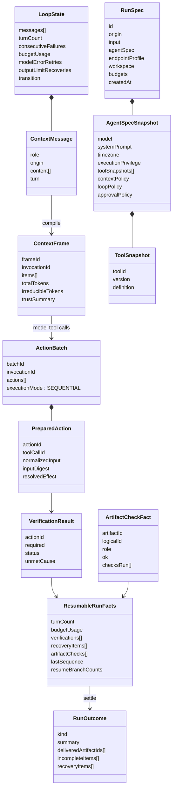

# 06. 核心数据结构与事实轨道

## 1. 先看对象关系



## 2. `RunSpec`：冻结合同

源码：[`types/run.ts:268-291`](../../packages/harness-runtime/src/types/run.ts#L268-L291)。

它回答“这次 Run 当时是在什么条件下执行的”：

- 谁发起：CLI / WEB / EVAL；
- 目标是什么；
- 哪个模型与 endpoint profile；
- 哪个 system prompt、时区和执行特权；
- 可用工具的完整声明快照；
- Context、Loop、Approval policy；
- workspace 身份；
- 预算。

生命周期：

```text
compose.makeRunSpec()
→ HarnessRuntime.start() 深冻结
→ SqliteRunStore.createRun() 原子存储
→ resume() 从库读回并再次深冻结
```

不要把它和 `ComposeOptions` 混淆：ComposeOptions 是当前进程如何装配；RunSpec 是某次历史 Run 真正使用了什么。

## 3. `LoopState`：当前段的工作内存

源码：[`types/loop.ts:14-31`](../../packages/harness-runtime/src/types/loop.ts#L14-L31)。

它适合放完整消息数组、临时重试计数等当前循环状态；不落盘、不跨进程。持久化边界只抽取那些无法从消息反推的累计事实到 `ResumableRunFacts`。

辨别方式：

- “下一次 while 迭代要用” → 多半在 LoopState；
- “进程死后还必须知道” → 必须进入 transcript / RunSpec；
- “只是给人看过程” → RunEvent；
- “只是当前 await 的句柄” → 进程内对象，不应落盘。

## 4. `ContextMessage`、`ModelContent`、`ContextItem`、`ContextFrame`

这四层最容易混：

| 层 | 目的 | 关键字段 |
|---|---|---|
| `ModelContent` | 中性内容块 | text/reasoning/tool_call/tool_result |
| `ContextMessage` | transcript 可恢复消息 | role、origin、turn、content |
| `ContextItem` | 编译期逐块语义 | trust、protocolRole、hash、estimatedTokens |
| `ContextFrame` | 单次模型调用完整输入 | invocationId、总 token、不可压缩量、trust summary |

源码分别见：

- [`types/context.ts:61-73`](../../packages/harness-runtime/src/types/context.ts#L61-L73)；
- [`types/transcript.ts:29-38`](../../packages/harness-runtime/src/types/transcript.ts#L29-L38)；
- [`types/context.ts:75-87`](../../packages/harness-runtime/src/types/context.ts#L75-L87)；
- [`types/context.ts:89-111`](../../packages/harness-runtime/src/types/context.ts#L89-L111)。

这是一条“逐步增加约束”的管线，不是四种重复消息类型。

## 5. `ToolDefinition` 与 `ToolSnapshot`

源码：[`types/tool.ts:210-327`](../../packages/harness-runtime/src/types/tool.ts#L210-L327)。

`ToolDefinition` 只保留 Runtime 真正消费的声明：

- 名字、描述、input schema；
- Effect resolution；
- redaction；
- idempotency；
- timeout；
- progress reporting；
- execution-time verification；
- recovery observation；
- 是否等待人类。

`ToolSnapshot` 包装工具 id、版本和完整 definition。它随 AgentSpec 冻结；resume 的幂等/可观察分流必须读冻结快照，不能读今天工具包中的新声明。

判断一个新字段是否该进 `ToolDefinition` 的标准：**Runtime 中是否存在真实消费者？** 如果只在工具文件里填写、Runtime 从不读取，它会制造能力已经存在的错觉。

## 6. Action 模型

源码：[`types/tool.ts:329-408`](../../packages/harness-runtime/src/types/tool.ts#L329-L408)。

### `ProposedAction`

仍包含模型原始输入，stage 是 PROPOSED。`toolCallId` 是模型协议配对锚点。

### `PreparedAction`

在 schema 校验和 Effect 解析后形成，新增：

- `normalizedInput`；
- `inputDigest`；
- `resolvedEffect`；
- `preparedAt`。

只有 PreparedAction 才允许进入 Policy/Approval/执行。授权边界不能建立在 `rawInput` 自由文本上。

### `ExecutionAttempt`

记录一次实际执行的开始/结束、成功/失败、副作用状态、输出与错误。副作用状态比 status 更重要：工具失败可能是 NOT_STARTED，也可能 UNKNOWN 或 PARTIALLY_APPLIED。

### `ActionBatch`

关联一次 model invocation，包含按序 PreparedAction，执行模式恒为 SEQUENTIAL。

## 7. `ResolvedEffect`：安全判定的中间表示

源码：[`types/tool.ts:17-80`](../../packages/harness-runtime/src/types/tool.ts#L17-L80)。

字段：

- `effectType`：READ / WRITE / DELETE / EXECUTE / NETWORK / NONE；
- `operation`：人可读动作；
- `scope.kind/value`：已规范化目标；
- `reversibility`；
- `riskFacts`；
- 可选 `dataMovement`；
- `digest`。

它是模型自由参数与 Policy 之间的可信 IR。Policy 不重新解析 path/shell/URL，而读取这个规范化对象。

## 8. `VerificationResult`、`ArtifactCheckFact`、`RunOutcome`

### Action 级 `VerificationResult`

源码：[`types/tool.ts:456-525`](../../packages/harness-runtime/src/types/tool.ts#L456-L525)。

问：“这一次 Action 声称要达到的外部效果是否达成？”

- status：PASSED / FAILED / SKIPPED；
- required：是否影响 success；
- `unmetCause`：USER_REJECTED、NO_APPROVAL、POLICY_DENIED、TOOL_FAILED、CANCELLED 等事实归因。

### Artifact 级 `ArtifactCheckFact`

源码：[`types/run.ts:219-233`](../../packages/harness-runtime/src/types/run.ts#L219-L233)。

问：“这个产物本身是否完整、合法、与登记实体一致？”

它带 role，因此可以区分坏掉的 DELIVERABLE 与坏掉的 INTERMEDIATE。

### `RunOutcome`

源码：[`types/run.ts:328-344`](../../packages/harness-runtime/src/types/run.ts#L328-L344)。

它是上述结构化事实的最终汇总，不是第二次重新观察。`deliveredArtifactIds` 只包含最终版本、角色为 DELIVERABLE 且检查通过的产物。

## 9. `ResumableRunFacts`：不能从 messages 反推的累计事实

源码：[`types/run.ts:162-217`](../../packages/harness-runtime/src/types/run.ts#L162-L217)。

包含：

- turnCount；
- consecutiveFailures；
- BudgetUsage；
- VerificationResult[]；
- RecoveryItem[]；
- lastSequence；
- resumeBranchCounts；
- ArtifactCheckFact[]。

它不是状态快照，因为 messages 仍从 transcript 重建。它是“消息之外仍必须跨进程继承的事实包”。主循环每轮边界整体写一条新 RUN_META，读侧取最后一条。

## 10. `RunEvent`：诊断语言

源码：[`types/event.ts:24-234`](../../packages/harness-runtime/src/types/event.ts#L24-L234)。

可以按阶段分组：

| 阶段 | 事件 |
|---|---|
| Run/Turn | RunStarted、TurnStarted、LoopContinued、LoopTerminated |
| Context/Model | ContextFrameCompiled、ContextCompacted、ModelStreamDelta、ModelInvocationCompleted、ModelInvocationAuditFailed |
| Action | ActionBatchPlanned、ActionProposed、ActionRejected、AttemptStarted/Completed、ActionBatchSettled |
| 人机 | ApprovalRequested/Decided、InteractionRequested/Completed、InterjectionAccepted |
| Resource/Artifact | ToolResultExternalized、ResourceStored/Failed、ArtifactRegistered/Verified |
| Guard | BudgetSoft/HardLimit、NoProgressDetected、RuntimeErrorOccurred、EndpointBehaviorDrift |
| Recovery | ResumeStarted、ResumeUnpairedToolUse、RecoveryRequired/Resolved、InteractionResumed、ResumeExternalToolsUnverifiable |

每个事件都带同 Run 内单调 `sequence` 与 `occurredAt`。事件本身不落 transcript，Trace sink 决定是否保存。

## 11. `RunStatus`、`Terminal`、`RunOutcome` 不相等

### `RunStatus`

数据库/界面生命周期投影：RUNNING、WAITING_FOR_APPROVAL、WAITING_FOR_INTERACTION、RECOVERY_REQUIRED、COMPLETED、FAILED、CANCELLED。定义见 [`types/run.ts:293-313`](../../packages/harness-runtime/src/types/run.ts#L293-L313)。

### `Terminal`

一次 generator 执行段的具名出口。定义见 [`types/loop.ts:44-91`](../../packages/harness-runtime/src/types/loop.ts#L44-L91)。`RECOVERY_REQUIRED` 是 Terminal，但不是 Run 终态。

### `RunOutcome`

只有已结算的 Run 才有 outcome。RECOVERY_REQUIRED 不产生 outcome，因为 Run 尚未结束。

映射集中在 [`facade/index.ts:978-991`](../../packages/harness-runtime/src/facade/index.ts#L978-L991)。不要从字符串相似性自行推导。

## 12. 人机等待的数据结构

[`PendingHub`](../../apps/workagent-service/src/human-channels.ts#L50-L124) 用：

```ts
Map<pendingId, {
  pending: UiPending;
  resolve: (answer | undefined) => void;
}>
```

waiter 是当前进程中的 Promise 句柄，不落库。`pendingId` 同时是应答幂等 key：重复点击只有第一次能从 Map 中取到 waiter。取消时 AbortSignal 删除 waiter 并 resolve undefined。

跨进程只有 `runs.status` 能说明“上次可能崩在等待”，真正 await 的 Promise 不可能恢复。

## 13. 事实来源矩阵

| 问题 | 权威来源 | 不要误用 |
|---|---|---|
| 这次 Run 用哪个模型/工具/预算？ | 冻结 RunSpec | 当前 `.env` / 当前 compose |
| 模型下一轮看见什么？ | transcript 重建 + 当前 compile | Trace / UI DOM |
| 已花多少预算？ | 最后一条 RUN_META | UI 自行累加事件 |
| 某个工具是否有 result？ | transcript messages | AttemptCompleted 事件 |
| 这一步是否达成？ | VerificationResult | ToolHandler `ok` 单独判断 |
| 交付物是否合格？ | ArtifactCheckFact + 最终版本规则 | 文件存在 / Action 验证 |
| 为什么继续/终止？ | LoopContinued/LoopTerminated RunEvent | 比较前后消息猜测 |
| 当前是否真的有人在等？ | PendingHub 进程内 Map | 历史 WAITING status 单独判断 |
| 上次崩溃能否自动恢复副作用？ | 冻结 ToolSnapshot + ACTION_FACT + Verifier | 当前工具声明 |
| 原始 Provider 请求/流是什么？ | model audit sidecar | transcript/Trace |

## 14. 本章阅读检查

1. `ContextMessage` 和 `ContextItem` 为什么不能合并？
2. `RunStatus=RECOVERY_REQUIRED`、`Terminal.reason=RECOVERY_REQUIRED` 为什么存在，但 `RunOutcome` 不存在？
3. 为什么 `ToolSnapshot` 必须冻结完整 definition？
4. `ResolvedEffect` 为什么是安全 IR，而不是展示字符串？
5. 如何判断一条新字段应该放 LoopState、RunSpec、RUN_META 还是 RunEvent？
