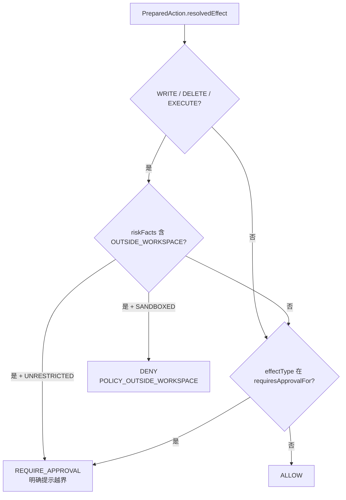
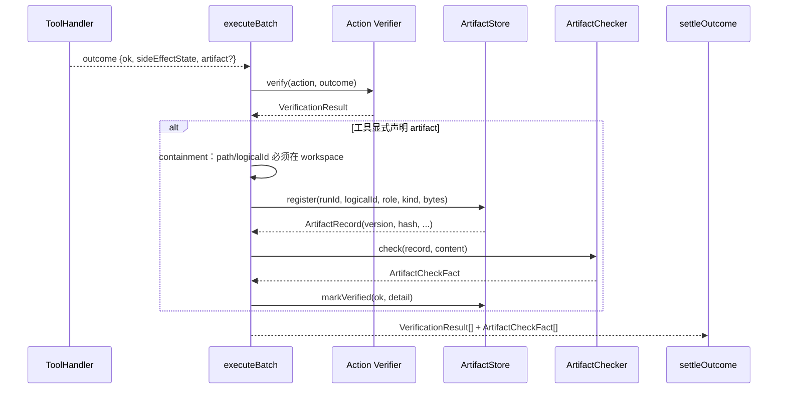

# 07. 工具、安全、审批与产物验证

## 1. 工具调用不是一个函数调用，而是一条受控管线

模型返回 `{name, input}` 只是提出行动。真正执行前，Atlas 把它变成：

```text
ToolCallRequest
→ schema 合法的 normalized input
→ 具有可信作用域的 PreparedAction
→ Policy verdict
→ Approval decision（如需要）
→ ExecutionAttempt
→ 脱敏后的 ToolResult
→ Action Verification
→ 可选 Artifact + Artifact Verification
→ Run 级 outcome 事实
```

这个分层的价值是：模型、工具和外部系统都不被当作单一真相来源。

## 2. 当前工具面

默认工具清单唯一出口是 [`compose.ts:136-159`](../../apps/cli/src/compose.ts#L136-L159)，实际由 `commonTools + microCaseTools + MCP snapshots` 构成。

### 通用场景工具

定义列表见 [`tools/common/src/index.ts:118-151`](../../tools/common/src/index.ts#L118-L151)：

- `list_dir`；
- `stat`；
- `read_file`；
- `search`；
- `write_file`；
- `edit_file`；
- `fetch_url`；
- `now`；
- `run_shell`（只有宿主支持沙箱时才进入默认工具面）。

### Harness 机制工具

列表见 [`tools/common/src/index.ts:153-173`](../../tools/common/src/index.ts#L153-L173)：

- `read_resource`：分页取回外置内容；
- `materialize_resource`：将 Resource 原样物化到 workspace；
- `request_handoff`：请求人去外部系统操作；
- `ask_user`：请求人做选择，没人回答时允许模型自己决定。

### 测量工具

`cases/micro-cases` 只保留：

- `append_log`：天然非幂等，用于让恢复分支二/三可测；
- `slow_write`：可控慢写，用于注入执行中取消。

这两个是测量装置，不是产品能力扩张。列表在 [`cases/micro-cases/src/index.ts:1-50`](../../cases/micro-cases/src/index.ts#L1-L50)。

### 外部 MCP 工具

启动时连接本地 stdio server、完成 `tools/list`，再桥接为带 `mcp__server__tool` 名字的 `ToolSnapshot`。桥接入口见 [`tools/mcp/src/tool-bridge.ts:177-284`](../../tools/mcp/src/tool-bridge.ts#L177-L284)。

它不解析具体 MCP schema，原样交给模型；缺失的 Atlas 声明由人工配置的 read/execute 档位和保守默认补齐。

## 3. Handler 如何组合

[`CompositeToolHandler`](../../apps/cli/src/composite.ts#L42-L70) 按 `handles(toolName)` 选择第一个认领者：

1. `CommonToolHandler`；
2. `MicroCaseToolHandler`；
3. 可选 `McpToolHandler`。

装配在 [`compose.ts:1029-1054`](../../apps/cli/src/compose.ts#L1029-L1054)。找不到认领者时返回结构化 TOOL_NOT_FOUND，不会把所有 handler 试一遍并吞掉真正的装配冲突。

`CommonToolHandler` 的 switch 在 [`tools/common/src/index.ts:210-415`](../../tools/common/src/index.ts#L210-L415)。这一层非常适合学习“schema 声明有了，但 handler 参数漏传一跳就整体失效”的 bug 形态。

## 4. schema 校验的失败方向

[`validateAndNormalize()`](../../packages/harness-runtime/src/tool-runtime/index.ts#L47-L129) 采用两种策略：

- Atlas 自家工具使用扁平标量 schema，并显式 `additionalProperties: false`，严格校验；
- 外部 MCP schema 可能包含 `$ref`、`oneOf`、数组 type 等未知构造，Atlas 认识的部分校验，不认识的原样放行给真正的 schema 作者——MCP server。

这不是安全层完全放开：Effect、Policy、Approval 仍在后面。它避免 Atlas 因“不理解 schema”而把合法参数裁成空对象，并在全程没有报错的情况下改写模型意图。

## 5. Effect Resolution：从自由文本到安全 IR

入口 [`DeclarativeEffectResolver.resolve()`](../../packages/harness-runtime/src/action/effect-resolver.ts#L20-L77) 有两档：

- `DECLARATIVE`：用 JSON pointer 取一个目标字段，将文件/目录 path 规范化为绝对路径；
- `RESOLVER`：按 `id@version` 查找 Composition Root 注入的 trusted resolver，适合 shell/MCP 这类无法靠单字段表达作用域的工具。

找不到 trusted resolver 必须抛错；回退成 NONE 会使工具绕过 Policy。

`ResolvedEffect` 是 Policy 唯一读取的安全 IR，包括 effectType、scope、reversibility、riskFacts、dataMovement 和 digest。类型见 [`types/tool.ts:17-80`](../../packages/harness-runtime/src/types/tool.ts#L17-L80)。

### 文件和 URL

通用 resolver 将 `../../etc/passwd` 一类输入规范化成真实绝对作用域，再标记 `OUTSIDE_WORKSPACE`；URL 则记录 EXTERNAL_ENDPOINT、DATA_LEAVES_HOST、query 参数名和目标 host，不把 query 值抄进 Trace。实现见 [`effect-resolver.ts:88-209`](../../packages/harness-runtime/src/action/effect-resolver.ts#L88-L209)。

### shell

[`ShellEffectResolver`](../../tools/common/src/exec/shell-effect-resolver.ts#L28-L164) 调用命令分析器，将只读白名单命令判成 READ，其余判成 EXECUTE；effect digest 包含命令原文，避免不同 shell 命令在 Progress Guard 中被误判成同一动作。

在 UNRESTRICTED 档下没有网络沙箱，即使模型没传 `allow_network` 也必须记录“无法排除数据外发”，不能写成“没有联网”。

### MCP

[`McpEffectResolver`](../../tools/mcp/src/tool-bridge.ts#L58-L152) 每个工具一个实例：

- read 档 → READ、幂等、只读；
- execute 档 → EXECUTE、非幂等、不可逆；
- 两档都记录 EXTERNAL_PROCESS、NO_SANDBOX、DATA_LEAVES_HOST；
- 参数不解析，data movement 明确写“去向与范围无法判定”。

## 6. Policy

[`evaluatePolicy()`](../../packages/harness-runtime/src/action/policy.ts#L42-L134) 只读 `ResolvedEffect`、冻结的 `ApprovalPolicy` 和冻结的 `ExecutionPrivilege`。



当前 TRUSTED_PERSONAL 要求 WRITE、DELETE、EXECUTE 审批，见 [`policy.ts:136-139`](../../packages/harness-runtime/src/action/policy.ts#L136-L139)。但后续 ApprovalDecider 可根据产品档位自动批准，所以“Policy 需要审批”和“最终一定弹窗”不是同一事实。

## 7. 两条正交档位轴

### 审批档位 `ApprovalMode`

定义与解析在 [`compose.ts:328-397`](../../apps/cli/src/compose.ts#L328-L397)：

- `CONFIRM`：每个**需要审批的**操作都问；READ/fetch_url 本来就不进入 decider；
- `DEFAULT`：workspace 内、非 EXECUTE、非 IRREVERSIBLE 的写有限自动放行；
- `AUTO`：所有抵达 decider 的操作自动批准。

它可在运行中切换，不进 RunSpec。每条 `ApprovalDecided.decidedBy` 逐项记录 HUMAN、AUTO、AUTO_GRANT 或 UNDECLARED。

### 执行特权 `ExecutionPrivilege`

定义在 [`types/run.ts:22-68`](../../packages/harness-runtime/src/types/run.ts#L22-L68)：

- SANDBOXED；
- UNRESTRICTED。

它随 RunSpec 冻结，运行中不能改。原因是它决定副作用当时是否有沙箱/边界，resume 必须与当前装配严格一致。

### 为什么正交

```text
审批轴：要不要停下来问人
执行轴：真正运行时能碰到什么
```

`AUTO + SANDBOXED` 仍有沙箱；`CONFIRM + UNRESTRICTED` 无沙箱但逐次问；只有 `AUTO + UNRESTRICTED` 同时去掉两类闸门。

## 8. 默认档自动放行算法

[`autoGrantVerdict()`](../../apps/cli/src/compose.ts#L542-L583) 只有三条都满足才批准：

1. 不是 EXECUTE；
2. 不是 IRREVERSIBLE；
3. FILE/DIRECTORY scope 在执行前 realpath 校验后仍位于 workspace 内。

它由 CLI 与 Web 共用。审批档位在 Composition Root，而非 Runtime；Runtime 只看 `ApprovalDecider` 的一次结果。

## 9. 浏览器审批通道

[`PendingHub.approvalDecider()`](../../apps/workagent-service/src/human-channels.ts#L128-L285) 每次调用重新读取当前档位：

1. AUTO 或本 Run 已 elevation → `decidedBy=AUTO`；
2. DEFAULT 且 autoGrant 成功 → `AUTO_GRANT`；
3. 否则构造 `UiPending`，放进 `Map<pendingId, waiter>` 并等待；
4. 用户应答 → HUMAN；
5. Run 取消/等待中断 → approved=false、UNDECLARED，不能冒充用户拒绝。

展示给人的 command、description、scope、MCP args 会先通过 [`stripUnsafeDisplayChars()`](../../apps/cli/src/compose.ts#L585-L618) 剥离 ANSI、控制符、零宽和双向控制字符。`textContent` 防 HTML 注入，但不能防 Trojan Source 式视觉欺骗，所以两层都需要。

## 10. shell 沙箱的边界

`run_shell` 的实现很长，建议按四段读：

1. ToolDefinition 与 schema：[`run-shell.ts:1-220`](../../tools/common/src/exec/run-shell.ts#L1-L220)；
2. 命令分析：[`command-analysis.ts:1-260`](../../tools/common/src/exec/command-analysis.ts#L1-L260)；
3. Effect：[`shell-effect-resolver.ts:28-164`](../../tools/common/src/exec/shell-effect-resolver.ts#L28-L164)；
4. 沙箱 profile：[`sandbox.ts:149-242`](../../tools/common/src/exec/sandbox.ts#L149-L242)。

SANDBOXED 时：

- 只允许写 workspace 与本次调用创建的 `$TMPDIR`；
- 网络默认拒绝，只有模型显式 `allow_network=true` 才开放；
- 传给子进程的环境变量使用白名单，并把 TMPDIR 指向允许目录；
- `.env`、`.git`、`.ssh` 等凭证读禁规则同时进入沙箱 deny；
- 宿主不支持沙箱时 `run_shell` 根本不进入默认工具面，不静默降级无沙箱。

UNRESTRICTED 时上述执行沙箱不生效，但凭证类文件工具读禁和 env 白名单仍是独立机制；不要把它们当成同一层。

## 11. 读与外发的三条护栏

Atlas 允许文件读取越出 workspace，因为办公资料/代码仓库常在工作目录外；但“读 + 外发”会形成信息泄露。当前三条护栏：

1. 文件凭证读黑名单：[`read-guard.ts:98-139`](../../tools/common/src/fs/read-guard.ts#L98-L139)；
2. `fetch_url` 拒绝私网与 localhost：[`url-guard.ts:96`](../../tools/common/src/net/url-guard.ts#L96) 附近；
3. URL/MCP/shell Effect 记录 riskFacts 与 dataMovement，进入 `ActionProposed` 事件。

第 3 条是可审计，不是阻断。读代码时要区分“护栏是 deny”还是“护栏只是让风险可见”。

## 12. Action Verification

[`CommonVerifier`](../../tools/common/src/index.ts#L425-L582) 实现三个方法：

- `observePre`：执行前拍文件 exists/bytes/hash；
- `observePost`：崩溃恢复时比较当前外部世界；
- `verify`：Attempt 后重新观察目标是否达到计划。

当前重点支持 write_file、edit_file、materialize_resource。`CompositeVerifier` 必须路由三个方法，见 [`composite.ts:73-124`](../../apps/cli/src/composite.ts#L73-L124)。漏掉 observePre 不会让普通执行失败，却会使所有恢复分支二静默退化成分支三。

## 13. Resource 与 Artifact 不是一回事

| 概念 | 问题 | 生命周期 |
|---|---|---|
| Resource | “工具结果太大/是二进制，如何保留证据并按需取回？” | 内容寻址 blob + 独立 ref |
| Artifact | “这是不是本次 Run 对用户交付的东西？” | 工具显式声明、按 logicalId 版本化、关联 Run |

大工具结果自动外置成 Resource，不会自动升级为 Artifact。否则任何临时网页响应或大文件读取都会被误认成交付物。

`ResourceStorePort` 见 [`ports/index.ts:502-542`](../../packages/harness-runtime/src/ports/index.ts#L502-L542)，`ArtifactStorePort` 见 [`ports/index.ts:544-627`](../../packages/harness-runtime/src/ports/index.ts#L544-L627)。

## 14. Artifact 登记与两层验证



Action 级验证只证明“磁盘内容等于模型计划的内容”。如果模型计划写一份坏 JSON，它仍会通过。Artifact 级检查再问“这份 JSON 能否解析、ZIP 是否具有完整头尾、文本编码是否合法、二进制魔数是否匹配、磁盘 hash 是否与登记一致”。

检查器入口见 [`artifact-checks/index.ts:181-253`](../../tools/common/src/artifact-checks/index.ts#L181-L253)。

## 15. Artifact 版本与最终交付

[`SqliteArtifactStore.register()`](../../packages/store-sqlite/src/artifact-store.ts#L57-L157) 的语义：

- 内容相同、同 Run、同 role → 复用版本；
- 内容变化 → version + 1；
- 跨 Run 或 role 变化，即使字节相同也不能复用旧记录；
- 字符串按 UTF-8、Uint8Array 按原字节 hash 和计 size。

最终 `deliveredArtifactIds` 不是“所有历史通过的 artifact”。[`splitArtifactChecks()`](../../packages/harness-runtime/src/verification/settle-outcome.ts#L137-L222) 按每个 logicalId 取最后一条事实：

- 最终版本 + DELIVERABLE + 检查通过 → 交付；
- 最终 DELIVERABLE 失败 → Run FAILED；
- 被取代的坏版本 → 仍保留为中间瑕疵，Run 至少 COMPLETED_WITH_LIMITS；
- INTERMEDIATE 即使通过也不进入交付清单。

## 16. 外部 MCP 的额外边界

MCP 进程在 Atlas Run 和逐次审批之前启动，运行在宿主用户权限下，不受 Atlas workspace 或 shell 沙箱约束。逐次审批只约束某一次模型请求的 `tools/call`，不约束 server 自主行为。

Atlas 能做的是：

- 名字加 `mcp__`，让人识别外部来源；
- read/execute 档位由人写配置，不信服务器 annotations；
- schema/description/tier 摘要进入 version，漂移可见；
- execute 默认需审批、非幂等、崩溃后进入 RECOVERY_REQUIRED；
- 结果标为外部不可信输入；
- 明确记录 NO_SANDBOX 与无法解析的数据流向。

Atlas 做不到的是证明浏览器登录态/账号在 resume 后仍是原来的。它发 `ResumeExternalToolsUnverifiable`，不硬拒，也不假装通过。

## 17. 本章阅读检查

1. Policy 为什么不能直接读模型原始 path 或 command？
2. CONFIRM 为什么不意味着 read_file/fetch_url 也弹审批？
3. UNRESTRICTED 为什么仍然可能每次弹审批？
4. Resource 与 Artifact 自动互转会造成什么错误语义？
5. 为什么 Artifact hash 检查必须重新读磁盘，不能只对登记入参自比？

建议验证：

```bash
npm run verify:tools
npm run verify:shell
npm run verify:artifact
npm run verify:resource
npm run verify:mcp
```

