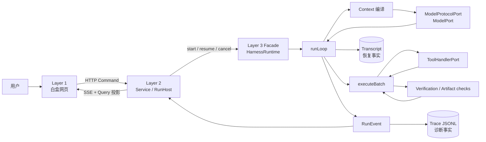

# Atlas 源码阅读指南

> 生成基线：2026-09-03，Git commit `b677f74`（`支持使用qwen3.8-flash，改进后评测分90分`）。  
> 阅读对象：当前 checked-in 代码、`README.md` 与可执行验收脚本。历史 V05/ADR 只用来理解“为什么”，不作为当前行为的权威来源。

## 1. 这套指南解决什么问题

Atlas 已经通过真实办公任务证明“能真正干活”，现在最有学习价值的问题不再是“它有哪些功能”，而是：

1. 用户在白盒网页输入一句任务后，代码究竟经过哪些对象、函数和事实轨道；
2. 模型为什么能循环调用工具，而不是只回答一段文字；
3. 一次工具调用如何依次经过 schema、Effect、Policy、Approval、执行、脱敏、验证、产物登记和结算；
4. 进程被杀掉后，Atlas 为什么能恢复，哪些事情又是它刻意不敢自动判断的；
5. Runtime、Service、UI、工具、端点适配器和 SQLite 各自拥有什么知识，为什么不能越界；
6. 哪些类型与数据结构才是系统的“骨架”，哪些文件只是展示或基础设施。

这不是按目录逐文件罗列的 API 文档。它按一条真实任务的纵向链路组织，再回头拆解横向机制。建议先完成“纵切”，建立一张运行时地图，再学习 Compact、恢复、预算等算法。

## 2. 建议阅读顺序

| 次序 | 文档 | 先回答的问题 |
|---:|---|---|
| 0 | 本页 | 整套指南怎么用，哪些事实最重要？ |
| 1 | [01-整体架构与边界.md](01-整体架构与边界.md) | Atlas 的分层、依赖方向和端口架构是什么？ |
| 2 | [02-从网页版白屏提交任务到Run启动.md](02-从网页版白屏提交任务到Run启动.md) | 点“开始”后，第一轮真正在哪里启动？ |
| 3 | [03-Harness主循环与ActionBatch.md](03-Harness主循环与ActionBatch.md) | Agent Loop 与工具执行闭环如何工作？ |
| 4 | [04-上下文编译模型调用与Compact.md](04-上下文编译模型调用与Compact.md) | 历史消息如何变成模型请求，太长时如何压缩？ |
| 5 | [05-持久化恢复与一致性.md](05-持久化恢复与一致性.md) | transcript 如何恢复，三条恢复分支如何选择？ |
| 6 | [06-核心数据结构与事实轨道.md](06-核心数据结构与事实轨道.md) | RunSpec、LoopState、Event、Resource、Artifact 各是什么？ |
| 7 | [07-工具安全审批与产物验证.md](07-工具安全审批与产物验证.md) | Atlas 如何约束副作用，并判断交付物可信？ |
| 8 | [08-源码实战阅读路线.md](08-源码实战阅读路线.md) | 如何带着一个真实 Run 动手读、打断点和做练习？ |
| 查阅 | [09-核心源码定位索引.md](09-核心源码定位索引.md) | 某个概念或函数应该去哪一行找？ |

如果只想先看“网页版提交任务”这条链，直接读第 2 篇，然后打开第 3 篇对照主循环。

## 3. 先记住 Atlas 的六句话

1. **Atlas 的核心不是 UI，也不是某个模型，而是 Harness Runtime。** UI 只是事实的一个观察面，模型只是一个经 Port 注入的决策器。
2. **一次 Run 的执行条件在开始时被冻结为 `RunSpec`。** 模型、工具声明、端点能力、workspace、时区、预算和执行特权都不能在 resume 时被“今天的配置”静默替换。
3. **恢复走 transcript，不走内存 `LoopState`，也不重放 Trace 事件。** transcript 是恢复事实源；Trace/Event 是诊断事实源。
4. **模型请求工具不等于工具立即执行。** 中间还有 Runtime 自持的 schema、Effect、Policy、Approval、Verification 与结算链。
5. **工具“返回成功”不等于任务完成，文件存在也不等于合格交付。** Atlas 分 Action 级 Verification 与 Artifact 级 Verification 两层判断。
6. **“做不到就说出来”是架构特征。** 外部 MCP 会话无法核对、工具副作用状态未知、损坏 transcript、非法旧 Schema，都不会被一个乐观默认值掩盖。

## 4. 一张最小心智模型



最关键的观察是：**命令向内，事实向外**。UI 发命令，但不推进 Runtime 状态；Runtime 产生事实，UI 只把事实投影出来。

## 5. 如何核对行号

本文档中的行号对应 commit `b677f74`。如果后续继续开发导致行号漂移：

```bash
git rev-parse --short HEAD
git show b677f74:packages/harness-runtime/src/loop/run-loop.ts | nl -ba | sed -n '350,430p'
rg -n 'export async function\* runLoop|export async function\* executeBatch|async startRun' \
  packages/harness-runtime/src apps/workagent-service/src
```

理解代码时，优先依赖“符号名 + 不变量”，不要只记绝对行号。行号是导航工具，不是架构本身。

## 6. 本指南采用的证据等级

- **当前代码**：行为的第一事实来源；文中的调用关系都从它追出。
- **可执行验收**：证明某条不变量真的能被打红；推荐在每章练习后运行相关 `verify:*`。
- **根 `README.md`**：当前对外契约与使用方式。
- **历史 ADR / V05**：解释取舍来源；与当前代码冲突时，以当前代码和验收为准。
- **源码注释**：本仓注释包含大量失败案例和反例，学习价值很高；但仍要继续寻找真实读取点、写入点与判据，避免把“声明存在”误当成“机制已接线”。

## 7. 最推荐的阅读方法

每读一个机制，都做四次追问：

1. **生产者是谁？** 例如 `RunEvent` 的这个字段在哪里写入。
2. **消费者是谁？** 如果全仓没有读取点，它可能只是看起来存在。
3. **权威副本在哪里？** 内存、SQLite、Trace 和 UI 中哪一个才决定恢复或结算。
4. **哪条验收能让它翻红？** 如果改坏一行仍全绿，要警惕这只是文档承诺。

Atlas 最值得学的并不是用了多少设计模式，而是它反复处理的同一种工程风险：**两个局部正确的决定在组合处可能产生一条错误事实；一段看似完整的链路可能因为没有消费者而根本没有运行。**

## 8. 本次交付验证记录

本指南生成后做了以下只读/验收核对：

- `npm run typecheck`：通过；
- `npm run verify:tools`：通过，18 条判据全绿；
- `npm run verify:ui`：通过，84 条判据全绿；
- `npm run verify:scenarios`：单独补跑通过，5 条判据全绿；
- 10 份 Markdown 的相对链接、源码行号上界和代码围栏：通过自动扫描；
- 全目录 15 个 Mermaid 代码块：分别使用 Mermaid 10.9.5 与 11.12.0 的实际解析器验证，两个版本均为 15/15 通过；
- `npm run verify:all`：依次通过 endpoint-profile、pairing、resume、compact、persistence、budget、crash、drift、tools、artifact、progress、shell、ui、mcp、model-audit，随后停在 `verify:resource` 的 F 段。

当前 `verify:resource` 的失败点是 [`apps/cli/src/verify/resource.ts:338`](../../apps/cli/src/verify/resource.ts#L338)：它对 `ResourceStore.getTextPage()` 默认返回的 12,000 字符分页内容直接 `JSON.parse`，而本次生成的 ResourceRefs 索引超过一页，得到 `Unterminated string in JSON at position 12000`。单独重跑 `npm run verify:resource` 可稳定复现。此次任务只新增阅读指南，没有修改生产代码或验收脚本；因此这里如实记录现状，不在文档任务中顺带改变实现。
